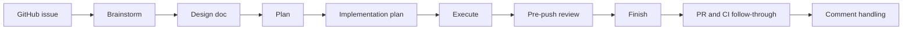

# Superteam

Orchestrate teams of agents with Superpowers.

Superteam turns a GitHub issue into a structured workflow that teams of agents can pick up, hand off, and continue without losing context.

It works with agent teams or subagents.

## The problem

Running multiple agents on one issue is easy to start and hard to sustain. Work gets split across chats, design decisions get lost, and the next agent often has to rediscover what already happened.

Superteam adds a disciplined workflow on top of Superpowers so agent work stays structured, reviewable, and resumable from design through finish.

## How Superteam works

Superteam runs one issue through a structured sequence so the next agent, or the next human, can continue from durable artifacts instead of chat history alone.



Each stage owns specific artifacts and verification gates, so work stays understandable across handoffs instead of becoming ad hoc subagent output.

## Why teams can pick up where they left off

Superteam is built around explicit stage ownership, written design and plan artifacts, verification before completion, and finish-stage review follow-through. That structure gives the next agent enough context to continue intelligently instead of starting over.

## Install Surfaces

- The repository root is the Claude Code plugin surface discovered via `.claude-plugin/plugin.json`.
- `plugins/superteam/` is the packaged Codex install surface.
- Author the skill in `skills/superteam/`, then refresh the packaged plugin with `pnpm sync:plugin` before publishing Codex-facing changes.

## Local Development

Use the repository root as the Claude plugin directory during local testing:

```bash
claude --plugin-dir .
```

The skill is exposed as `/superteam:superteam` once the plugin is loaded.
