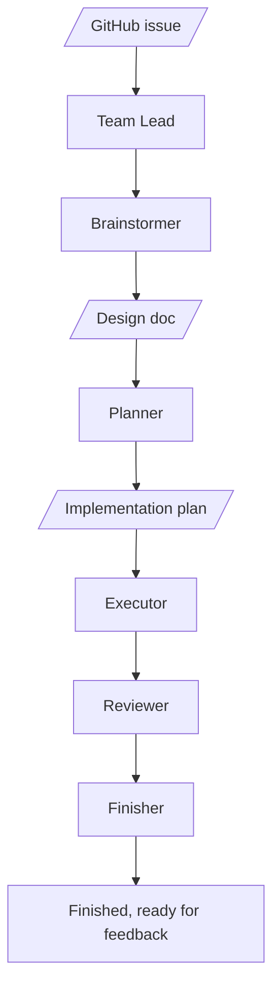

# Superteam

Orchestrate teams of agents with Superpowers.

Spend less time managing implementation loops and babysitting CI.

Superteam builds on Superpowers to get you to a real, demoable, testable artifact as quickly as possible, with enough structure to review it, iterate on it, and keep moving.

It works with agent teams or subagents.

## How Superteam works

Superteam runs one issue through a structured teammate workflow so the next agent, subagent, or human can continue from durable artifacts instead of chat history alone.



The workflow stays portable across agent teams and direct subagent handoffs because it is organized around teammate ownership, repo-owned artifacts, and explicit gates rather than one host runtime's mechanics.

Before any teammate edits governed files, the workflow discovers repository rules from the repo itself, starting with `AGENTS.md` and then any local docs that govern the files being touched.

Each teammate owns specific artifacts and verification gates, so work stays understandable across handoffs instead of becoming ad hoc subagent output. `Reviewer` owns local pre-publish findings. `Finisher` owns publish-state follow-through, branch and PR handling, CI, and external review feedback.

## Agent roster

| Teammate | Owns | Recommended `superpowers` skills |
| --- | --- | --- |
| Team Lead | Orchestration, delegation, gates, and loopbacks | `superpowers:using-superpowers`; `superpowers:dispatching-parallel-agents` when splitting independent work |
| Brainstormer | Design doc creation and approval handoff | `superpowers:brainstorming` |
| Planner | Approved implementation plan creation | `superpowers:writing-plans` |
| Executor | ATDD-driven implementation, code, and tests for the approved plan | `superpowers:test-driven-development`; `superpowers:systematic-debugging` when debugging; `superpowers:verification-before-completion`; `superpowers:writing-skills` when editing `skills/**/*.md` |
| Reviewer | Local pre-publish review findings and loopback classification | `superpowers:requesting-code-review` |
| Finisher | Publish-state follow-through, branch/PR/CI reporting, and external review feedback handling | `superpowers:finishing-a-development-branch`; `superpowers:receiving-code-review` when handling reviewer findings, PR comments, or bot feedback |

## Run superteam anytime

Superteam keeps the workflow grounded in explicit teammate ownership, written design and plan artifacts, verification before completion, and finish-owned review follow-through. That means you can invoke Superteam at any point in the lifecycle and have it resume from the right teammate instead of starting the whole process over.

For example:

```text
/superteam work on issue 16
/superteam new requirement: make it more super
```

## Install surfaces

- The repository root is the local Claude Code plugin surface discovered via `.claude-plugin/plugin.json`.
- `plugins/superteam/` is the packaged Codex plugin surface for this repository.

## Installation

Install Superpowers first by following the setup instructions in [`obra/superpowers`](https://github.com/obra/superpowers).

### Claude Code

1. After Superpowers is installed, register the Patina Project marketplace in Claude Code:

```bash
/plugin marketplace add patinaproject/skills
```

2. Install Superteam from that marketplace:

```bash
/plugin install superteam@patinaproject-skills
```

3. Open the relevant GitHub issue in your Claude Code session, then invoke:

```text
/superteam:superteam
```

### Optional: Enable Agent Teams

If you want Claude Code to use Agent Teams for this workflow, enable Agent Teams in your Claude configuration before invoking Superteam.

For local setup, add `CLAUDE_CODE_EXPERIMENTAL_AGENT_TEAMS` to the `env` block in `~/.claude/settings.json` for your user-wide config or `.claude/settings.json` for a project-specific config:

```json
{
  "env": {
    "CLAUDE_CODE_EXPERIMENTAL_AGENT_TEAMS": "1"
  }
}
```

Then run the same Superteam workflow as usual.

Agent Teams is optional. If you do not enable it, Superteam still works with the regular single-agent or subagent flow described above.

### OpenAI Codex CLI

1. After Superpowers is installed, install or enable the packaged `Superteam` Codex plugin from the plugin source you use for Codex.
2. When working from this repository directly, treat `plugins/superteam/` as the packaged Codex plugin surface.
3. Open the relevant GitHub issue in your working context, then invoke Superteam:

```text
Use $superteam to route this issue through teammate-owned design, planning, execution, review, and Finisher-owned publish follow-through.
```

### OpenAI Codex App

1. After Superpowers is installed, install or enable the packaged `Superteam` Codex plugin from the plugin source you use for Codex.
2. When working from this repository directly, treat `plugins/superteam/` as the packaged Codex plugin surface.
3. Open the relevant GitHub issue in the app context, then invoke Superteam:

```text
Use $superteam to route this issue through teammate-owned design, planning, execution, review, and Finisher-owned publish follow-through.
```

## First use

After setup in any supported tool, start from a GitHub issue and invoke Superteam through the same teammate-owned workflow. The issue then moves through design, planning, execution, review, and finish handoffs.

## Inspiration

- BMAD-Method: Grateful to BMAD for introducing us to agentic frameworks; our earlier quick-dev and TEA experiments helped shape this workflow.
- Superpowers: Foundational skills framework that brought this to life.
- Ken Kocienda's *Creative Selection*: Importance of demo culture.
