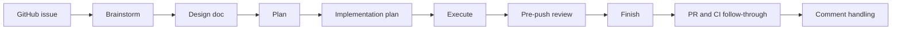

# Superteam

Orchestrate teams of agents with Superpowers.

Spend less time managing implementation loops and babysitting CI.

Superteam builds on Superpowers to get you to a real, demoable, testable artifact as quickly as possible, with enough structure to review it, iterate on it, and keep moving.

It works with agent teams or subagents.

Without that structure, work gets split across chats, decisions get lost, and the next agent often has to rediscover what already happened.

## How Superteam works

Superteam runs one issue through a structured sequence so the next agent, or the next human, can continue from durable artifacts instead of chat history alone.



Each stage owns specific artifacts and verification gates, so work stays understandable across handoffs instead of becoming ad hoc subagent output.

## Agent roster

| Stage | Agent | Superpowers skill |
| --- | --- | --- |
| Brainstorm | Brainstormer | `superpowers:brainstorming` |
| Plan | Planner | `superpowers:writing-plans` |
| Execute | Implementer | `superpowers:subagent-driven-development` |
| Review | Reviewer | `superpowers:requesting-code-review` |
| Finish | Finisher | `superpowers:finishing-a-development-branch` |

## Why teams can pick up where they left off

Superteam is built around explicit stage ownership, written design and plan artifacts, verification before completion, and finish-stage review follow-through. That structure gives the next agent enough context to continue intelligently instead of starting over.

## Install surfaces

- The repository root is the Claude Code plugin surface discovered via `.claude-plugin/plugin.json`.
- `plugins/superteam/` is the packaged Codex install surface.

## Installation

Install Superpowers first by following the setup instructions in:

```text
https://github.com/obra/superpowers
```

### Claude Code

1. After Superpowers is installed, register the Patina Project marketplace in Claude Code:

```bash
/plugin marketplace add patinaproject/skills
```

2. Install Superteam from that marketplace:

```bash
/plugin install superteam@patinaproject-skills
```

3. Start from a GitHub issue and invoke:

```text
/superteam:superteam
```

### Optional: Enable Agent Teams

If you want a team-oriented runtime, enable Agent Teams in your Claude Code setup and then run the same workflow through Superteam.

Agent Teams lets multiple agents coordinate through the staged workflow. The regular setup runs the same workflow with a single agent or subagents.

### OpenAI Codex CLI

1. After Superpowers is installed, add the Patina Project marketplace from GitHub:

```bash
codex plugin marketplace add patinaproject/skills --ref main
codex plugin marketplace upgrade
```

2. Open the Codex Plugin Directory, open the `Patina Project` marketplace, and install `Superteam`.
3. Open the relevant GitHub issue in your working context, then invoke:

```text
Use $superteam to take this issue from design through review-ready execution.
```

### OpenAI Codex App

1. After Superpowers is installed, in a terminal or Codex CLI session add the Patina Project marketplace from GitHub:

```bash
codex plugin marketplace add patinaproject/skills --ref main
codex plugin marketplace upgrade
```

2. In the Codex app, open the Plugin Directory, open the `Patina Project` marketplace, and install `Superteam`.
3. Open the relevant GitHub issue in the app context, then invoke:

```text
Use $superteam to take this issue from design through review-ready execution.
```

## First use

After setup in any supported tool, start from a GitHub issue and invoke Superteam. The workflow then drives the issue through design, planning, execution, review, and handoff artifacts.

## Inspiration

- BMAD-Method: Grateful to BMAD for introducing us to agentic frameworks; our earlier quick-dev and TEA experiments helped shape this workflow.
- Superpowers: Foundational skills framework that brought this to life.
- Ken Kocienda's *Creative Selection*: Importance of demo culture.
