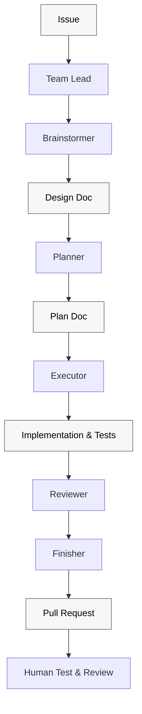
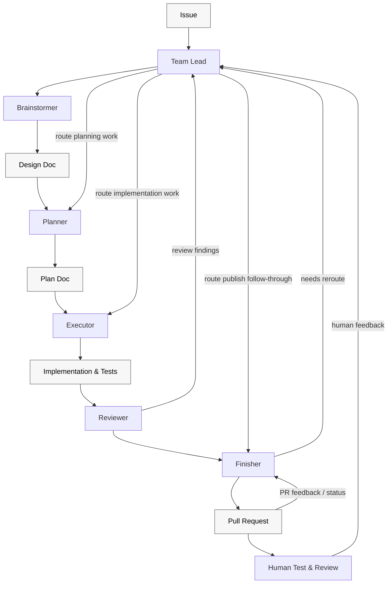

# Superteam

Orchestrate teams of agents with Superpowers.

Spend less time managing implementation loops and babysitting CI.

Superteam builds on Superpowers to get you to a real, demoable, testable artifact as quickly as possible, with enough structure to review it, iterate on it, and keep moving.

It works with agent teams or subagents.

Without that structure, work gets split across chats, decisions get lost, and the next agent often has to rediscover what already happened.

## How Superteam works

Superteam runs one issue through a structured teammate workflow so the next agent, subagent, or human can continue from durable artifacts instead of chat history alone.





The workflow stays portable across agent teams and direct subagent handoffs because it is organized around teammate ownership, repo-owned artifacts, and explicit gates rather than one host runtime's mechanics.

Before any teammate edits governed files, the workflow discovers repository rules from the repo itself, starting with `AGENTS.md` and then any local docs that govern the files being touched.

Each teammate owns specific artifacts and verification gates, so work stays understandable across handoffs instead of becoming ad hoc subagent output. `Reviewer` owns local pre-publish findings. `Finisher` owns publish-state follow-through, branch and PR handling, CI, and external review feedback.

## What Happens At Each Stage

This is the short version of what developers should expect during a normal run:

- `Team Lead`: reads the issue, discovers repo rules, decides which teammate should act next, and halts the run when a gate is not satisfied instead of hand-waving it away.
- `Brainstormer`: turns the issue into a design doc, captures the active acceptance criteria, and asks for explicit approval before planning starts. If there are real approval-relevant concerns, they should be surfaced here.
- `Planner`: converts the approved design into an implementation plan with concrete tasks. `Planner` is supposed to consume the approved design doc, not improvise from chat summaries.
- `Executor`: implements only the approved plan, including the required tests and verification evidence. `Executor` does not push branches or open PRs.
- `Implementation & Tests`: this is the durable output of execution. By the time work reaches review, the branch should already contain the code, tests, and local verification needed to judge the implementation.
- `Reviewer`: performs local pre-publish review, checks that the right artifacts exist, verifies the reported evidence, classifies any findings as implementation-level, plan-level, or spec-level so loopbacks are routed correctly, and pressure-tests skill/workflow changes before publish.
- `Finisher`: owns everything needed to publish and stabilize the branch on GitHub. That includes pushing, opening or updating the PR, checking CI and mergeability, handling external feedback, and making sure the run does not end early.
- `Pull Request`: this is the published artifact for the current branch state. It is a milestone, not the end of the workflow.
- `Human Test & Review`: this is where a person can demo, test, and review the published branch. Human feedback loops back through `Team Lead`, while PR-surface status and findings loop back through `Finisher`.

In practice, this means `superteam` should not report success just because code exists locally, a PR was opened once, or CI looked healthy in a single snapshot. A run is only actually complete when the published branch state is stable enough to hand off cleanly or an explicit blocker is reported.

## Agent roster

| Teammate | Owns | Recommended `superpowers` skills |
| --- | --- | --- |
| Team Lead | Orchestration, delegation, gates, and loopbacks | `superpowers:using-superpowers`; `superpowers:dispatching-parallel-agents` when splitting independent work |
| Brainstormer | Design doc creation and approval handoff | `superpowers:brainstorming` |
| Planner | Approved implementation plan creation | `superpowers:writing-plans` |
| Executor | Code and tests for the approved plan | `superpowers:test-driven-development`; `superpowers:systematic-debugging` when debugging; `superpowers:verification-before-completion`; `superpowers:writing-skills` when editing `skills/**/*.md` |
| Reviewer | Local pre-publish review findings and loopback classification | `superpowers:requesting-code-review`; `superpowers:writing-skills` when reviewing `skills/**/*.md` or workflow-contract docs |
| Finisher | Publish-state follow-through, branch/PR/CI reporting, and external review feedback handling | `superpowers:finishing-a-development-branch`; `superpowers:receiving-code-review` when handling reviewer findings, PR comments, or bot feedback |

## Run superteam anytime

Superteam keeps the workflow grounded in explicit teammate ownership, written design and plan artifacts, verification before completion, and finish-owned review follow-through. That means you can invoke Superteam at any point in the lifecycle and have it resume from the right teammate instead of starting the whole process over.

For example:

```text
For a resumed issue, invoke Superteam with the same runtime-specific entry point and tell it to continue from the current teammate or artifact state.
For a new requirement, invoke Superteam with the documented runtime-specific form and include the requirement change in the prompt so it can route back through the right gate.
```

## Install surfaces

- The repository root is the Claude Code plugin surface discovered via `.claude-plugin/plugin.json`.
- `plugins/superteam/` is the packaged Codex install surface.

## Installation

Install Superpowers first by following the setup instructions in:

```text
https://github.com/obra/superpowers
```

### Claude Code

1. After Superpowers is installed, register the Patina Project marketplace in Claude Code:

```bash
/plugin marketplace add patinaproject/skills
```

2. Install Superteam from that marketplace:

```bash
/plugin install superteam@patinaproject-skills
```

3. Start from a GitHub issue and invoke:

```text
/superteam:superteam
```

### Optional: Enable Agent Teams

If you want a team-oriented runtime, enable Agent Teams in your Claude Code setup and then run the same workflow through Superteam.

Agent Teams lets multiple agents coordinate through the staged workflow. The regular setup runs the same workflow with a single agent or subagents.

### OpenAI Codex CLI

1. After Superpowers is installed, add the Patina Project marketplace from GitHub:

```bash
codex plugin marketplace add patinaproject/skills --ref main
codex plugin marketplace upgrade
```

2. Open the Codex Plugin Directory, open the `Patina Project` marketplace, and install `Superteam`.
3. Open the relevant GitHub issue in your working context, then invoke:

```text
Use $superteam to route this issue through teammate-owned design, planning, execution, review, and Finisher-owned publish follow-through.
```

### OpenAI Codex App

1. After Superpowers is installed, in a terminal or Codex CLI session add the Patina Project marketplace from GitHub:

```bash
codex plugin marketplace add patinaproject/skills --ref main
codex plugin marketplace upgrade
```

2. In the Codex app, open the Plugin Directory, open the `Patina Project` marketplace, and install `Superteam`.
3. Open the relevant GitHub issue in the app context, then invoke:

```text
Use $superteam to route this issue through teammate-owned design, planning, execution, review, and Finisher-owned publish follow-through.
```

## First use

After setup in any supported tool, start from a GitHub issue and invoke Superteam. The workflow then drives the issue through teammate-owned design, planning, execution, review, and finish handoffs.

## Inspiration

- BMAD-Method: Grateful to BMAD for introducing us to agentic frameworks; our earlier quick-dev and TEA experiments helped shape this workflow.
- Superpowers: Foundational skills framework that brought this to life.
- Ken Kocienda's *Creative Selection*: Importance of demo culture.
