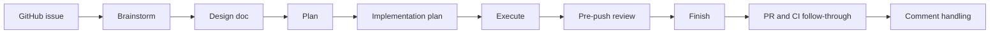

# Superteam

Orchestrate teams of agents with Superpowers.

Superteam turns a GitHub issue into a structured workflow that teams of agents can pick up, hand off, and continue without losing context.

It works with agent teams or subagents.

## The problem

Running multiple agents on one issue is easy to start and hard to sustain. Work gets split across chats, design decisions get lost, and the next agent often has to rediscover what already happened.

Superteam adds a disciplined workflow on top of Superpowers so agent work stays structured, reviewable, and resumable from design through finish.

## How Superteam works

Superteam runs one issue through a structured sequence so the next agent, or the next human, can continue from durable artifacts instead of chat history alone.



Each stage owns specific artifacts and verification gates, so work stays understandable across handoffs instead of becoming ad hoc subagent output.

## Why teams can pick up where they left off

Superteam is built around explicit stage ownership, written design and plan artifacts, verification before completion, and finish-stage review follow-through. That structure gives the next agent enough context to continue intelligently instead of starting over.

## Install surfaces

- The repository root is the Claude Code plugin surface discovered via `.claude-plugin/plugin.json`.
- `plugins/superteam/` is the packaged Codex install surface.

## Installation

### Claude Code

1. Add the `patinaproject/skills` marketplace source in Claude Code before you try to install Superteam.
2. Install or enable Superteam from that marketplace listing.
3. Start from a GitHub issue and run Superteam in Claude Code.

Use the repository root as the Claude plugin directory during local testing:

```bash
claude --plugin-dir .
```

Once loaded, start from a GitHub issue and invoke:

```text
/superteam:superteam
```

### Optional: Enable Agent Teams

If you want a team-oriented runtime, enable Agent Teams in your Claude Code setup and then run the same workflow through Superteam.

Agent Teams lets multiple agents coordinate through the staged workflow. The regular setup runs the same workflow with a single agent or subagents.

### OpenAI Codex CLI

1. Add the `patinaproject/skills` marketplace source in OpenAI Codex CLI before first use.
2. Install or enable Superteam from that marketplace listing.
3. Open the relevant GitHub issue in your working context, then invoke the `superteam` skill in OpenAI Codex CLI.

### OpenAI Codex App

1. Add the `patinaproject/skills` marketplace source in the OpenAI Codex app before first use.
2. Add or enable Superteam from that marketplace listing.
3. Open the relevant GitHub issue in the app context, then invoke the `superteam` skill in OpenAI Codex App.

## First use

After setup in any supported tool, start from a GitHub issue and invoke Superteam. The workflow then drives the issue through design, planning, execution, review, and handoff artifacts.
