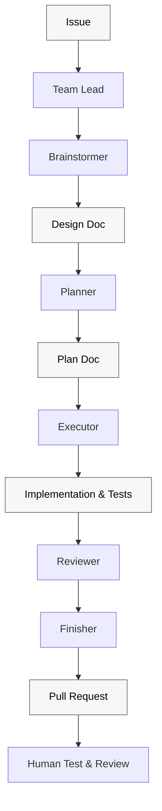
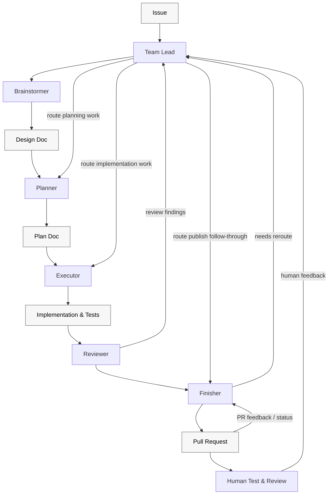

# Superteam

Build with a team of agents using Superpowers.

`superteam` is a Claude Code + Codex plugin. It ships an installable orchestration skill under `skills/superteam/` and is distributed through the [`patinaproject/skills`](https://github.com/patinaproject/skills) marketplace.

Spend less time managing implementation loops and babysitting CI. Superteam builds on Superpowers to get you to a real, demoable, testable artifact as quickly as possible, with enough structure to review it, iterate on it, and keep moving.

## What this plugin does

Superteam takes one GitHub issue and routes it through a structured teammate workflow — `Team Lead`, `Brainstormer`, `Planner`, `Executor`, `Reviewer`, `Finisher` — so the next agent, subagent, or human can continue from durable artifacts (design doc, plan doc, branch, PR) instead of chat history alone.





The workflow stays portable across agent teams and direct subagent handoffs because it is organized around teammate ownership, repo-owned artifacts, and explicit gates rather than one host runtime's mechanics.

## What happens at each stage

- `Team Lead`: reads the issue, discovers repo rules, decides which teammate should act next, and halts the run when a gate is not satisfied.
- `Brainstormer`: turns the issue into a design doc, captures the active acceptance criteria, and asks for explicit approval before planning starts.
- `Planner`: converts the approved design into an implementation plan with concrete tasks.
- `Executor`: implements only the approved plan, including tests and verification evidence. Does not push branches or open PRs.
- `Reviewer`: performs local pre-publish review, classifies findings as implementation-, plan-, or spec-level, and pressure-tests skill/workflow changes before publish.
- `Finisher`: pushes, opens or updates the PR, monitors CI and mergeability, interprets external PR feedback, and keeps the run alive until the published branch state is stable.

A run is only complete when the published branch state is stable enough to hand off cleanly or an explicit blocker is reported.

## Agent roster

| Teammate | Owns | Recommended `superpowers` skills |
| --- | --- | --- |
| Team Lead | Orchestration, delegation, gates, and loopbacks | `superpowers:using-superpowers`; `superpowers:dispatching-parallel-agents` when splitting independent work |
| Brainstormer | Design doc creation and approval handoff | `superpowers:brainstorming` |
| Planner | Approved implementation plan creation | `superpowers:writing-plans` |
| Executor | ATDD-driven implementation, code, and tests for the approved plan | `superpowers:test-driven-development`; `superpowers:systematic-debugging`; `superpowers:verification-before-completion`; `superpowers:writing-skills` when editing `skills/**/*.md` |
| Reviewer | Local pre-publish review intake, finding classification, loopback routing | `superpowers:requesting-code-review`; `superpowers:receiving-code-review`; `superpowers:writing-skills` when reviewing `skills/**/*.md` |
| Finisher | Publish-state follow-through, branch/PR/CI reporting, external post-publish review feedback | `superpowers:finishing-a-development-branch`; `superpowers:receiving-code-review` |

## Installation

`superteam` ships as a Claude Code + Codex plugin. Other supported editors read the repository-level files this plugin emits (`AGENTS.md`, `.cursor/`, `.windsurfrules`, `.github/copilot-instructions.md`) directly. Install Superpowers first by following the setup instructions in [`obra/superpowers`](https://github.com/obra/superpowers).

### Claude Code

1. Register the Patina Project marketplace:

   ```text
   /plugin marketplace add patinaproject/skills
   ```

2. Install the plugin:

   ```text
   /plugin install superteam@patinaproject-skills
   ```

3. Open the relevant GitHub issue in your Claude Code session, then invoke:

   ```text
   /superteam:superteam
   ```

#### Optional: Enable Agent Teams

If you want Claude Code to use Agent Teams for this workflow, enable Agent Teams in your Claude configuration before invoking Superteam. Add `CLAUDE_CODE_EXPERIMENTAL_AGENT_TEAMS` to the `env` block in `~/.claude/settings.json` (user-wide) or `.claude/settings.json` (project-specific):

```json
{
  "env": {
    "CLAUDE_CODE_EXPERIMENTAL_AGENT_TEAMS": "1"
  }
}
```

Agent Teams is optional. If you do not enable it, Superteam still works with the regular single-agent or subagent flow. When using Agent Teams, prefer them for bounded, independent teammate work; keep highly interactive or clarification-heavy steps in the foreground.

### OpenAI Codex CLI

1. Register the Patina Project marketplace:

   ```bash
   codex plugin marketplace add patinaproject/skills
   ```

2. Install the plugin:

   ```bash
   codex plugin marketplace add patinaproject/superteam
   ```

3. Invoke from the target repository:

   ```text
   Use $superteam to route this issue through teammate-owned design, planning, execution, review, and Finisher-owned publish follow-through.
   ```

### OpenAI Codex App

1. Install or enable the `superteam` plugin from your Codex plugin source.
2. Open the target repository in the app.
3. Invoke:

   ```text
   Use $superteam to route this issue through teammate-owned design, planning, execution, review, and Finisher-owned publish follow-through.
   ```

When `Finisher` is waiting on external publish-state in the Codex app, prefer a thread automation attached to the current thread so follow-through stays in the same conversation context.

### GitHub Copilot

No plugin install required. This repo ships `.github/copilot-instructions.md`, which Copilot Chat reads automatically when the repo is open in your editor.

```text
@workspace Use the superteam skill for the workflow described above.
```

### Cursor

No plugin install required. This repo ships `.cursor/rules/superteam.mdc`, which Cursor loads as a project rule whenever the repo is open. Ask the Cursor agent to apply `superteam`.

### Windsurf

No plugin install required. This repo ships `.windsurfrules`, which Windsurf reads natively when the repo is open. Ask Cascade to apply `superteam`.

### Aider, Zed, Cline, Opencode

No plugin install required. These tools read `AGENTS.md` natively. Open the repo and ask the assistant to apply the `superteam` workflow described in `AGENTS.md`.

## Usage

```text
/superteam:superteam work on issue 16
/superteam:superteam new requirement: make it more super
/superteam:superteam resume from review
```

Superteam keeps the workflow grounded in explicit teammate ownership, written design and plan artifacts, verification before completion, and finish-owned review follow-through. You can invoke Superteam at any point in the lifecycle and have it resume from the right teammate instead of starting over.

## Development

This repository is the source for the plugin. Local workflow:

```bash
pnpm install           # installs dev deps and wires husky
pnpm lint:md           # markdownlint-cli2
pnpm check:versions    # enforce package.json ↔ plugin manifests lockstep
pnpm commitlint        # one-off commit-message validation
```

Commits and PR titles follow `type: #<issue> short description`.

Releases are driven by [release-please](https://github.com/googleapis/release-please) — merge the standing release PR to cut a new `vX.Y.Z`. See [`RELEASING.md`](./RELEASING.md).

## Contributing

See [`CONTRIBUTING.md`](./CONTRIBUTING.md) and [`AGENTS.md`](./AGENTS.md).

## Inspiration

- BMAD-Method: Grateful to BMAD for introducing us to agentic frameworks; our earlier quick-dev and TEA experiments helped shape this workflow.
- Superpowers: Foundational skills framework that brought this to life.
- Ken Kocienda's *Creative Selection*: Importance of demo culture.

## Related

- [`skills/superteam/SKILL.md`](./skills/superteam/SKILL.md) — skill contract.
- [`patinaproject/skills`](https://github.com/patinaproject/skills) — marketplace distributing Patina Project plugins.
- [`patinaproject/bootstrap`](https://github.com/patinaproject/bootstrap) — scaffolding skill that emitted this repo's baseline.
