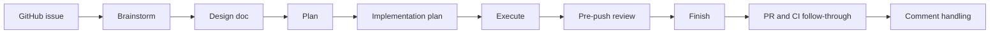

# Plan: Improve the install experience for Superteam users [#7](https://github.com/patinaproject/superteam/issues/7)

> **For agentic workers:** REQUIRED SUB-SKILL: Use superpowers:subagent-driven-development (recommended) or superpowers:executing-plans to implement this plan task-by-task. Steps use checkbox (`- [ ]`) syntax for tracking.

**Goal:** Make the repository landing page explain what Superteam does, the problem it solves, and how its continuity-first workflow operates before readers encounter installation mechanics.

**Architecture:** Rewrite `README.md` as a problem-first onboarding surface centered on one flagship workflow for Superteam. Keep install-surface details accurate but move them below the product explanation, then align any supporting docs that still contradict the new landing-page narrative.

**Tech Stack:** Markdown, Mermaid diagram syntax, Claude Code plugin metadata, Codex plugin packaging docs, ripgrep, git

---

### Task 1: Rewrite the landing-page opening around the product and problem

**Files:**
- Modify: `README.md`
- Test: `README.md`

- [ ] **Step 1: Capture the current README gaps before editing**

Run:

```bash
sed -n '1,120p' README.md
```

Expected:
- the file opens with install surfaces instead of a clear product/problem statement
- there is no continuity or handoff explanation near the top
- there is no flagship workflow section

- [ ] **Step 2: Replace the top README sections with a problem-first introduction**

Update `README.md` so the opening section begins with:

```md
# Superteam

Orchestrate teams of agents with Superpowers.

Superteam turns a GitHub issue into a structured workflow that teams of agents can pick up, hand off, and continue without losing context.

It works with agent teams or subagents.
```

Immediately after that opening, add a short section that explains the problem in plain language:

```md
## The problem

Running multiple agents on one issue is easy to start and hard to sustain. Work gets split across chats, design decisions get lost, and the next agent often has to rediscover what already happened.

Superteam adds a disciplined workflow on top of Superpowers so agent work stays structured, reviewable, and resumable from design through finish.
```

- [ ] **Step 3: Verify the new opening states the product, problem, and runtime model**

Run:

```bash
rg -n "Orchestrate teams of agents with Superpowers|The problem|agent teams or subagents" README.md
```

Expected:
- one match for the headline
- one match for `## The problem`
- one match that states runtime compatibility in neutral terms

- [ ] **Step 4: Commit the README opening rewrite**

Run:

```bash
git add README.md
git commit -m "docs: #7 rewrite superteam landing page opening"
```

### Task 2: Add a flagship workflow section and continuity-first diagram

**Files:**
- Modify: `README.md`
- Test: `README.md`, `skills/superteam/SKILL.md`

- [ ] **Step 1: Lift the canonical workflow stages from the skill before editing the README**

Run:

```bash
sed -n '1,120p' skills/superteam/SKILL.md
```

Expected:
- the stage order is visible as brainstorm, plan, execute, pre-push review, finish, comment handling
- the skill describes artifact ownership and resumable workflow behavior

- [ ] **Step 2: Add a flagship workflow section to the README**

Insert a new section after `## The problem`:

````md
## How Superteam works

Superteam runs one issue through a structured sequence so the next agent, or the next human, can continue from durable artifacts instead of chat history alone.



Each stage owns specific artifacts and verification gates, so work stays understandable across handoffs instead of becoming ad hoc subagent output.
````

Keep the stage names consistent with `skills/superteam/SKILL.md`.

- [ ] **Step 3: Add one short continuity section below the workflow**

Append this section directly after `## How Superteam works`:

```md
## Why teams can pick up where they left off

Superteam is built around explicit stage ownership, written design and plan artifacts, verification before completion, and finish-stage review follow-through. That structure gives the next agent enough context to continue intelligently instead of starting over.
```

- [ ] **Step 4: Verify the README matches the skill's workflow vocabulary**

Run:

```bash
rg -n "Brainstorm|Plan|Execute|Pre-push review|Finish|Comment handling|Why teams can pick up where they left off" README.md
```

Expected:
- matches for all six stage names in `README.md`
- one match for the continuity section heading

- [ ] **Step 5: Commit the workflow and continuity additions**

Run:

```bash
git add README.md
git commit -m "docs: #7 add workflow and continuity overview"
```

### Task 3: Move install guidance below understanding and connect it to first use

**Files:**
- Modify: `README.md`
- Test: `README.md`

- [ ] **Step 1: Replace the current install-surface block with an install section that follows the workflow narrative**

Update the lower half of `README.md` so the installation details appear after the product and workflow sections, using this structure:

````md
## Install surfaces

- The repository root is the Claude Code plugin surface discovered via `.claude-plugin/plugin.json`.
- `plugins/superteam/` is the packaged Codex install surface.
- Author the skill in `skills/superteam/`, then refresh the packaged plugin with `pnpm sync:plugin` before publishing Codex-facing changes.

## Claude Code setup

Use the repository root as the Claude plugin directory during local testing:

```bash
claude --plugin-dir .
```

Once loaded, start from a GitHub issue and invoke:

```text
/superteam:superteam
```

### Optional: Enable Agent Teams

If you want a team-oriented runtime, enable Agent Teams in your Claude Code setup and then run the same workflow through Superteam.

Agent Teams lets multiple agents coordinate through the staged workflow. The regular setup runs the same workflow with a single agent or subagents.

## First use

Start from a GitHub issue and invoke the skill. Superteam will drive the issue through design, planning, execution, review, and handoff artifacts.
````

Keep the install facts accurate, but ensure they no longer appear before the product explanation.

- [ ] **Step 2: Verify the README section order is onboarding-first**

Run:

```bash
rg -n "^## " README.md
```

Expected:
- `## The problem` appears before any install section
- `## How Superteam works` appears before `## Install surfaces`
- `## Claude Code setup` exists after installation guidance
- `## First use` exists after the setup sections

- [ ] **Step 3: Sanity-check the landing-page scan as a first-time user**

Run:

```bash
sed -n '1,220p' README.md
```

Expected:
- a short scan explains what Superteam is
- runtime compatibility is visible without implying a preference
- the optional Agent Teams subsection is present with a brief difference explanation
- install guidance leads into a concrete first-use action

- [ ] **Step 4: Commit the install-flow restructuring**

Run:

```bash
git add README.md
git commit -m "docs: #7 connect install guidance to first use"
```

### Task 4: Align supporting docs with the new landing-page narrative

**Files:**
- Modify: `docs/file-structure.md`
- Test: `README.md`, `docs/file-structure.md`

- [ ] **Step 1: Check whether the structure guide now conflicts with the README framing**

Run:

```bash
sed -n '1,220p' docs/file-structure.md
```

Expected:
- the file remains contributor-focused
- no opening language claims that repo structure is the primary user onboarding surface

- [ ] **Step 2: If needed, tighten the opening of `docs/file-structure.md` so it stays contributor-facing**

If the top section reads like user onboarding, replace the opening paragraph with:

```md
This document is a contributor reference for the repository layout. For user-facing installation and workflow onboarding, start with `README.md`.
```

Do not change the rest of the structure guide unless required for consistency with the install-surface terms used in `README.md`.

- [ ] **Step 3: Verify README and file-structure docs use the same install-surface names**

Run:

```bash
rg -n "Claude Code plugin surface|packaged Codex install surface|skills/superteam|pnpm sync:plugin" README.md docs/file-structure.md
```

Expected:
- the install-surface names match across both files
- `README.md` remains the user-facing starting point

- [ ] **Step 4: Commit the supporting-doc alignment**

Run:

```bash
git add README.md docs/file-structure.md
git commit -m "docs: #7 align supporting docs with onboarding flow"
```

### Task 5: Verify acceptance-criteria coverage and record the planning artifact

**Files:**
- Modify: `docs/superpowers/plans/2026-04-22-7-improve-the-install-experience-for-superteam-users-plan.md`
- Test: `README.md`, `docs/file-structure.md`, `git status`

- [ ] **Step 1: Verify the plan covers every approved acceptance criterion**

Check the design doc and map it to implementation tasks:

```text
AC-7-1 -> Tasks 1 and 3
AC-7-2 -> Task 2
AC-7-3 -> Task 1
AC-7-4 -> Tasks 1 and 3
AC-7-5 -> Task 2
AC-7-6 -> Task 3
AC-7-7 -> Task 3
```

- [ ] **Step 2: Verify the plan file follows the branch-based naming rule**

Run:

```bash
find docs/superpowers -maxdepth 2 -type f | sort
```

Expected:
- `docs/superpowers/specs/2026-04-22-7-improve-the-install-experience-for-superteam-users-design.md`
- `docs/superpowers/plans/2026-04-22-7-improve-the-install-experience-for-superteam-users-plan.md`

- [ ] **Step 3: Review the working tree before execution handoff**

Run:

```bash
git status --short
```

Expected:
- only the issue `#7` design and plan artifacts are staged or modified before implementation begins

- [ ] **Step 4: Commit the implementation plan**

Run:

```bash
git add docs/superpowers/plans/2026-04-22-7-improve-the-install-experience-for-superteam-users-plan.md
git commit -m "docs: #7 add install experience implementation plan"
```
