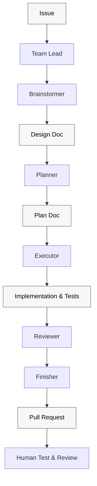
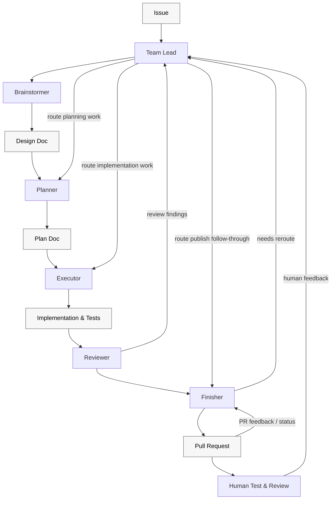

# Plan: superteam ends early before workflow is complete [#18](https://github.com/patinaproject/superteam/issues/18)

> **For agentic workers:** REQUIRED SUB-SKILL: Use `superpowers:subagent-driven-development` (recommended) or `superpowers:executing-plans` to implement this plan task-by-task. Steps use checkbox (`- [ ]`) syntax for tracking.

**Goal:** Remove any notion of valid local-only completion from `superteam`, require PR publication on every run, keep `Finisher` alive through publication and post-publish follow-through, and block completion until mergeability, required checks, PR metadata requirements, unresolved inline review threads, unresolved top-level finding comments, and other blocking external PR feedback are handled on the latest pushed state, or the operator is prompted explicitly when the state cannot be determined safely.

**Architecture:** Tighten the contract at the source of truth in `skills/superteam/SKILL.md`, extend first-stage approval guidance to surface approval-relevant concerns, add a clearer Mermaid workflow diagram with explicit loopbacks, mirror the broader publication-plus-post-publish `Finisher` loop in the directly relevant `Finisher` support text, then add pressure-test coverage for invalid local-only completion, early-stop, status-snapshot, top-level-finding accounting, summary-only dedupe, and operator-prompt failure modes. Keep the change documentation-focused and avoid broad workflow rewrites.

**Tech Stack:** Markdown docs, repository-local workflow assets, `pnpm sync:plugin`, `rg`, `sed`, `find`

---

## File Structure

- `docs/superpowers/specs/2026-04-23-18-superteam-ends-early-before-workflow-is-complete-design.md`
  - Approved design doc and acceptance source for this issue.
- `docs/superpowers/plans/2026-04-23-18-superteam-ends-early-before-workflow-is-complete-plan.md`
  - This implementation plan.
- `skills/superteam/SKILL.md`
  - Canonical `superteam` workflow contract; primary source of shutdown behavior.
- `skills/superteam/agent-spawn-template.md`
  - Directly relevant `Finisher` teammate prompt surface that must mirror shutdown blocking and operator-escalation language if needed.
- `docs/superpowers/pressure-tests/superteam-orchestration-contract.md`
  - Repo-local pressure tests that verify the workflow halts or reroutes for the shutdown failure mode.
- `README.md`
  - Public-facing workflow documentation that should mirror the approved diagrams and explain each stage clearly for developers.
- `plugins/superteam/skills/superteam/`
  - Packaged copy refreshed via `pnpm sync:plugin` after source skill changes.

### Task 1: Tighten the canonical approval, publication, and shutdown contract

**Files:**
- Modify: `skills/superteam/SKILL.md`

- [ ] **Step 1: Inspect the current shutdown and external-feedback wording**

Run: `rg -n "Shutdown|shutdown|bot findings|review threads|operator|complete" skills/superteam/SKILL.md`
Expected: locate the existing shutdown checklist and nearby `Finisher` language that governs completion.

- [ ] **Step 2: Write the minimal contract change in the source skill**

Update `skills/superteam/SKILL.md` so it states all of the following in one consistent shutdown path:

```md
When Brainstormer asks for approval, include any remaining approval-relevant concerns that could materially affect the decision to approve, revise, or narrow the design.

## Shutdown

Shutdown is a success-only action. Do not shut down or present the run as complete unless every required shutdown check passes on the latest pushed PR state.

Every superteam run is expected to publish a PR. Local-only state is never a valid complete, demoable, or handoffable result.

Before shutdown:

1. Verify the current branch has been pushed and the active PR exists.
2. Verify the active PR and the current branch state after the latest push.
3. Check unresolved inline review threads on the latest PR head.
4. Check for recent blocking external PR feedback on the latest pushed state.
5. Treat the following as blocking:
   - an unpushed branch or missing PR
   - unresolved inline review threads on the latest PR head
   - unresolved reviewer or bot feedback posted after the latest push that requests a code change, verification rerun, follow-up response, or other concrete corrective action before the PR is ready
6. Record final unresolved blocking-feedback counts for the latest pushed state, including inline threads and top-level finding comments.
7. Treat any nonzero unresolved blocking-feedback count as a blocker.
8. Only dedupe a top-level comment when it is explicitly a summary of already-audited inline findings on the latest pushed state.
9. If blocking feedback exists, dispatch `Finisher`-owned feedback handling and re-check.
10. If the state cannot be determined safely, prompt the operator instead of guessing.
11. Only request shutdown when all required shutdown checks pass. Otherwise halt with an explicit blocker.
```

The edit should preserve the existing ownership model: `Finisher` owns publication and external feedback, requirement-bearing feedback still routes through spec then plan then execution, ambiguous state blocks success, top-level findings without inline companions still count, and local-only state is never a valid completion mode.

- [ ] **Step 3: Review the updated skill text in context**

Run: `sed -n '1,260p' skills/superteam/SKILL.md`
Expected: the shutdown section reads cleanly, uses `blocking external PR feedback` consistently, and does not weaken existing routing rules.

### Task 2: Add the Mermaid workflow diagram requirements

**Files:**
- Modify: `skills/superteam/SKILL.md`
- Modify: `docs/superpowers/specs/2026-04-23-18-superteam-ends-early-before-workflow-is-complete-design.md`

- [ ] **Step 1: Add the two-chart diagram requirement to the source contract**

Update the source workflow docs so they require two Mermaid diagrams:

```md
- one chronological chart for the forward teammate/artifact sequence
- one orchestration chart for `Team Lead` routing and feedback intake
- only two block types: teammates and artifacts
- `Implementation & Tests` as an artifact between `Executor` and `Reviewer`
- `Pull Request` as an artifact leading to `Human Test & Review`
- lighter artifact treatment with black text for readability
- `Human Test & Review` routes only to `Team Lead`
- `Pull Request` may route back to `Finisher` for PR feedback / status
```

- [ ] **Step 2: Use the approved Mermaid blocks**

Carry these exact Mermaid structures into the implementation surface that owns the workflow diagrams:





- [ ] **Step 3: Re-read the diagram requirement for clarity**

Run: `rg -n "Workflow Diagrams|Human Test & Review|PR feedback / status|review findings|needs reroute|classDef artifact" skills/superteam/SKILL.md docs/superpowers/specs/2026-04-23-18-superteam-ends-early-before-workflow-is-complete-design.md`
Expected: the approved two-chart structure and readability constraints are represented clearly.

### Task 2.5: Mirror the workflow diagrams and stage explanations in the public README

**Files:**
- Modify: `README.md`

- [ ] **Step 1: Replace the stale single-chart workflow summary**

Update the README workflow section so it uses the approved two-chart model rather than the older single chart that ends at a generic finished state.

- [ ] **Step 2: Add a concise developer-facing stage explanation section**

Add a short section that explains what developers should expect at each stage:

```md
- `Team Lead`: routes work, enforces gates, and stops the run when a contract is not satisfied
- `Brainstormer`: creates the design doc and approval packet
- `Planner`: turns the approved design into executable tasks
- `Executor`: implements the approved plan and local verification
- `Implementation & Tests`: durable output of execution before review
- `Reviewer`: local pre-publish review and loopback classification
- `Finisher`: push, PR publication, CI, external feedback, and final completion checks
- `Pull Request`: published branch artifact, treated as a milestone not the end
- `Human Test & Review`: human feedback surface that routes back through `Team Lead`
```

Keep the wording short, practical, and developer-oriented rather than reprinting the full internal skill contract.

- [ ] **Step 3: Re-read the README for parity with the approved workflow**

Run: `rg -n "How Superteam works|What Happens At Each Stage|Human Test & Review|PR feedback / status|needs reroute" README.md`
Expected: the README mirrors the approved workflow diagrams and includes a concise stage-by-stage explanation.

### Task 3: Mirror the publication, shutdown, and counting rules in the directly relevant Finisher prompt surface

**Files:**
- Modify: `skills/superteam/agent-spawn-template.md`

- [ ] **Step 1: Inspect the existing Finisher role-specific prompt block**

Run: `sed -n '110,220p' skills/superteam/agent-spawn-template.md`
Expected: locate the `Finisher` block and confirm whether shutdown-specific blocking language is currently missing or too soft.

- [ ] **Step 2: Add explicit shutdown-success and operator-escalation instructions if needed**

Update the `Finisher` block so it includes wording equivalent to:

```text
Every superteam run is expected to publish a PR. Local-only state is never a valid completion, demo, or handoff state.
Push the branch and create or update the PR before treating the run as being in publish-state follow-through.
Shutdown is success-only. Do not report completion or request shutdown until you have checked the active PR after the latest push for unresolved inline review threads and other blocking external PR feedback.
Treat unresolved inline review threads and unresolved post-latest-push reviewer or bot feedback requesting concrete corrective action as blocking.
Report final unresolved blocking-feedback counts for inline threads and top-level finding comments on the latest pushed state.
Treat any nonzero unresolved count as a blocker.
Only dedupe a top-level comment when it is explicitly a summary of already-audited inline findings on the latest pushed state.
If blocking feedback exists, handle it through the Finisher-owned path and re-check.
If you cannot determine whether shutdown checks pass safely, prompt the operator and report the blocker instead of claiming completion.
```

Keep the existing done-report contract intact while making the shutdown guard hard to miss.

- [ ] **Step 3: Re-read the Finisher block for consistency with the source skill**

Run: `sed -n '1,240p' skills/superteam/agent-spawn-template.md`
Expected: `Finisher` guidance matches the canonical skill contract and still preserves branch-state-aware comment handling.

### Task 3.5: Require pressure-test review when the run changes skills or workflow-contract docs

**Files:**
- Modify: `skills/superteam/SKILL.md`
- Modify: `skills/superteam/agent-spawn-template.md`

- [ ] **Step 1: Tighten the Reviewer contract in the source skill**

Update the `Reviewer` contract so it states that when the run changes `skills/**/*.md` or workflow-contract docs, `Reviewer` should invoke `superpowers:writing-skills` and run the relevant pressure-test walkthrough before publish.

- [ ] **Step 2: Mirror the same rule in the Reviewer spawn block**

Update the `Reviewer` block so it:

```text
Recommend `superpowers:writing-skills` when reviewing changes to `skills/**/*.md` or workflow-contract docs.
When reviewing those files, run the relevant pressure-test walkthrough and report pass/fail results plus any loopholes found.
If a loophole is found, loop back before publish instead of treating the review as complete.
```

- [ ] **Step 3: Re-read the Reviewer surfaces for consistency**

Run: `rg -n "writing-skills|pressure-test|loophole|workflow-contract" skills/superteam/SKILL.md skills/superteam/agent-spawn-template.md`
Expected: both reviewer-facing surfaces clearly require pressure-test review for skill and workflow-contract changes.

### Task 4: Add pressure-test coverage for approval concerns, mandatory publication, top-level findings, dedupe, and fallback behavior

**Files:**
- Modify: `docs/superpowers/pressure-tests/superteam-orchestration-contract.md`

- [ ] **Step 1: Inspect the existing shutdown pressure test**

Run: `rg -n "Shutdown attempted|shutdown" docs/superpowers/pressure-tests/superteam-orchestration-contract.md`
Expected: find the current shutdown test that covers unresolved threads or bot findings.

- [ ] **Step 2: Expand the pressure-test wording to cover success-only shutdown and operator prompting**

Update the shutdown-related pressure tests so they explicitly cover:

```md
## Approval request omits remaining approval-relevant concerns

- Starting condition: Brainstormer requests approval while real approval-relevant concerns still exist, but the approval packet does not surface them.
- Required halt or reroute behavior: Halt approval and reissue the packet with the remaining approval-relevant concerns included, unless the concern is severe enough to block approval entirely.
- Rule surface: The first-stage approval contract should require Brainstormer to surface real approval-relevant concerns when present.

## Finisher stops with only local commits and no PR

- Starting condition: The run reaches Finisher-owned work with local commits present, but the branch is not pushed and the PR does not exist.
- Required halt or reroute behavior: Do not present the run as complete, demoable, or handoffable. Keep publication work with Finisher until the branch is pushed and the PR exists, or report an explicit blocker.
- Rule surface: The Finisher contract should make PR publication mandatory for every superteam run and eliminate local-only completion as a valid end state.

## Shutdown attempted with unresolved threads or blocking external PR feedback

- Starting condition: The workflow tries to shut down after publishing a PR, but unresolved inline review threads still exist on the latest PR head, or unresolved post-latest-push reviewer or bot feedback still requests concrete corrective action.
- Required halt or reroute behavior: Do not shut down or present the run as complete. Dispatch Finisher-owned follow-through, re-check, and only allow shutdown after the blocking items are cleared.
- Rule surface: The Finisher shutdown checklist should treat unresolved inline threads and blocking external PR feedback as shutdown blockers.

## Top-level finding comment has no inline companion

- Starting condition: A top-level reviewer or bot comment contains still-applicable findings on the latest pushed state, but there are no inline threads for those findings.
- Required halt or reroute behavior: Count the top-level finding comment as its own blocking finding source and do not allow shutdown while it remains unresolved.
- Rule surface: The Finisher shutdown contract should account for blocking top-level finding comments, not just inline threads.

## Top-level summary comment is deduped incorrectly

- Starting condition: The workflow drops a top-level comment from the final unresolved count without verifying that it is explicitly a summary of already-audited inline findings on the latest pushed state.
- Required halt or reroute behavior: Halt the shutdown report and require explicit audit evidence for the dedupe decision. If the comment includes standalone or mixed findings, count it separately.
- Rule surface: The Finisher shutdown contract should allow dedupe only for explicit summary comments of already-audited inline findings.

## Shutdown attempted when the external-feedback state cannot be determined safely

- Starting condition: The workflow cannot tell whether review threads or recent reviewer/bot findings still block the latest pushed state.
- Required halt or reroute behavior: Do not guess and do not present success. Halt with an explicit blocker and prompt the operator.
- Rule surface: The shutdown contract should require operator escalation when shutdown readiness cannot be determined safely.
```

- [ ] **Step 3: Re-read the pressure-test section in context**

Run: `sed -n '1,260p' docs/superpowers/pressure-tests/superteam-orchestration-contract.md`
Expected: the repo-local pressure tests now exercise both the original miss and the indeterminate-state fallback.

- [ ] **Step 4: Add reviewer-specific pressure-test coverage for skill changes**

Add pressure-test scenarios covering:

- a skill or workflow-contract change reviewed without invoking `superpowers:writing-skills`
- a skill change reviewed with only text-diff review and no pressure-test walkthrough
- a loophole found during the pressure-test walkthrough but ignored before publish

### Task 5: Refresh the packaged plugin copy and verify the repository state

**Files:**
- Modify via sync: `plugins/superteam/skills/superteam/SKILL.md`
- Modify via sync: `plugins/superteam/skills/superteam/agent-spawn-template.md`

- [ ] **Step 1: Sync the packaged plugin copy**

Run: `pnpm sync:plugin`
Expected: the plugin copy under `plugins/superteam/skills/superteam/` updates to match the source skill assets.

- [ ] **Step 2: Verify the packaged files reflect the source changes**

Run: `rg -n "success-only|blocking external PR feedback|prompt the operator" skills/superteam/SKILL.md skills/superteam/agent-spawn-template.md plugins/superteam/skills/superteam/SKILL.md plugins/superteam/skills/superteam/agent-spawn-template.md`
Expected: matching shutdown language appears in both source and packaged copies.

- [ ] **Step 3: Verify repo-local documentation coverage**

Run: `rg -n "approval-relevant concerns|publish a PR|local-only|demoable|handoffable|top-level|dedupe|prompt the operator|Do not shut down|Do not report completion" docs/superpowers/pressure-tests/superteam-orchestration-contract.md skills/superteam/SKILL.md skills/superteam/agent-spawn-template.md`
Expected: all core shutdown requirements are represented in the canonical skill, the Finisher prompt surface, and the pressure tests.

### Task 6: Final verification and commit

**Files:**
- Modify: `docs/superpowers/specs/2026-04-23-18-superteam-ends-early-before-workflow-is-complete-design.md`
- Modify: `docs/superpowers/plans/2026-04-23-18-superteam-ends-early-before-workflow-is-complete-plan.md`
- Modify: `skills/superteam/SKILL.md`
- Modify: `skills/superteam/agent-spawn-template.md`
- Modify: `docs/superpowers/pressure-tests/superteam-orchestration-contract.md`
- Modify via sync: `plugins/superteam/skills/superteam/SKILL.md`
- Modify via sync: `plugins/superteam/skills/superteam/agent-spawn-template.md`

- [ ] **Step 1: Review the exact changed files**

Run: `git diff -- docs/superpowers/specs/2026-04-23-18-superteam-ends-early-before-workflow-is-complete-design.md docs/superpowers/plans/2026-04-23-18-superteam-ends-early-before-workflow-is-complete-plan.md skills/superteam/SKILL.md skills/superteam/agent-spawn-template.md docs/superpowers/pressure-tests/superteam-orchestration-contract.md plugins/superteam/skills/superteam/SKILL.md plugins/superteam/skills/superteam/agent-spawn-template.md`
Expected: only the planned shutdown-focused changes appear.

- [ ] **Step 2: Confirm working tree state**

Run: `git status --short`
Expected: only the issue-18 spec, plan, source skill files, pressure tests, and synced plugin files are modified.

- [ ] **Step 3: Commit the completed issue work**

Run:

```bash
git add docs/superpowers/specs/2026-04-23-18-superteam-ends-early-before-workflow-is-complete-design.md \
        docs/superpowers/plans/2026-04-23-18-superteam-ends-early-before-workflow-is-complete-plan.md \
        skills/superteam/SKILL.md \
        skills/superteam/agent-spawn-template.md \
        docs/superpowers/pressure-tests/superteam-orchestration-contract.md \
        plugins/superteam/skills/superteam/SKILL.md \
        plugins/superteam/skills/superteam/agent-spawn-template.md
git commit -m "docs: #18 harden shutdown feedback checks"
```

Expected: one clean commit captures the approved spec tightening, implementation plan, source workflow changes, pressure tests, and synced packaged copy.

## Self-Review

- Spec coverage: Task 1 covers approval concerns, mandatory publication, invalid local-only completion, success-only shutdown, counting rules, top-level finding handling, and head-relative completeness. Task 2 covers the Mermaid workflow diagram requirements, Task 2.5 covers the public README workflow docs, Task 3 mirrors the rule in the directly relevant `Finisher` prompt surface, Task 3.5 adds reviewer pressure-test requirements for skill changes, Task 4 covers the documented failure modes, and Task 5 verifies the packaged plugin copy. AC-18-1 through AC-18-14 each map to at least one explicit task.
- Placeholder scan: No `TODO`, `TBD`, or vague “handle later” instructions remain; every task lists exact files and concrete commands.
- Type consistency: The plan consistently uses `blocking external PR feedback`, `latest pushed state`, `prompt the operator`, and `success-only shutdown` across tasks.
