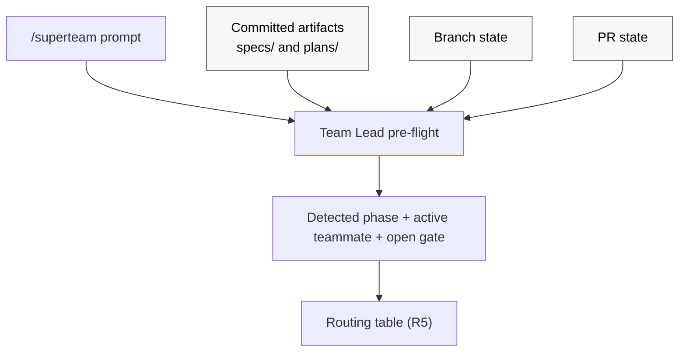

# Design: Superteam: optimize for repeated /superteam invocations and make workflow state more durable [#39](https://github.com/patinaproject/superteam/issues/39)

## Context

Developers using `superteam` have converged on a usage pattern the skill was
not built for: they prefix nearly every instruction with `/superteam` and rely
on the skill to figure out which phase they are in and route the prompt to the
correct teammate. Today `skills/superteam/SKILL.md` has no in-skill memory
between invocations. Phase is re-derived on every call from committed
artifacts (`docs/superpowers/specs/`, `docs/superpowers/plans/`), branch
state, and PR state. Because that re-derivation is not codified, repeated
`/superteam` calls re-enter from the top of `Team Lead` orchestration and may
mis-route, restart phases, or silently skip approval gates.

Symptoms (from issue #39 and observed behavior):

- Repeated `/superteam <new instruction>` calls mid-flow re-enter from the top
  of `Team Lead` orchestration and may mis-route, restart phases, or silently
  skip approval gates (e.g. Gate 1).
- A new instruction arriving mid-`Brainstormer`-approval is sometimes treated
  as a fresh design request rather than as feedback against the pending
  approval packet.
- A new instruction arriving mid-`Executor` may restart planning rather than
  routing as a plan-level or implementation-level loopback.
- Post-PR `Finisher` monitoring loses context across invocations, so a fresh
  `/superteam` call can be confused about whether the workflow is `triage`,
  `monitoring`, `ready`, or `blocked`.
- An ambiguous prompt during a loopback can be reinterpreted as a new top-of-
  workflow request because the skill has no codified phase-detection step.

## Intent

Change `skills/superteam/SKILL.md` so that:

1. Every `/superteam` invocation **must first detect the current phase** from
   already-existing observable signals before doing anything else.
2. Detection reads only artifacts and state that the workflow already
   produces: committed design and plan artifacts, branch state, PR state, and
   the prompt itself. No new persistence layer is introduced.
3. The default behavior on a repeated invocation is **resume and route**, not
   **restart**.
4. New prompts arriving mid-phase are classified explicitly as **resume**,
   **feedback for the active teammate / open gate**, **explicit loopback**,
   or **new top-of-workflow request**, with the routing for each case
   spelled out in `SKILL.md`.
5. When observable state is ambiguous or contradictory, the workflow halts
   with an explicit blocker rather than guessing.

This is a workflow-contract change scoped to a single skill
(`skills/superteam/SKILL.md`). It introduces no new artifact convention, no
new committed state file, and no new persistence surface. `Team Lead`'s
contract is extended to perform phase detection. The existing `Finisher`
state machine (`triage | monitoring | ready | blocked`) stays unchanged in
substance; it is detected from PR/CI signals rather than recorded.

## Requirements

R1. `skills/superteam/SKILL.md` must define a **phase-detection pre-flight**
that runs at the top of every `/superteam` invocation, before routing.

R2. The pre-flight must consult, in this precedence:

  (a) committed design artifacts under `docs/superpowers/specs/` and plan
      artifacts under `docs/superpowers/plans/` for the active issue;
  (b) branch state (current branch name, last commit author / message /
      trailers, recent commit history relevant to the active issue);
  (c) PR state for the active branch (exists, open/closed/merged, latest
      pushed head, required-check status, review thread state);
  (d) the user prompt content itself (issue references, approve/reject
      tokens, requirement-change language, status-check language).

The current phase is derived entirely from these observable signals; no
separate persisted phase record is consulted or written.

R5. `SKILL.md` must add an explicit **routing table** for repeated
invocations. For each `(detected_phase, prompt_classification)` pair, the
table must specify the teammate to route to and the action (resume,
deliver-as-feedback, open-loopback, or new-run). Required rows:

- phase=brainstorm, Gate 1 open, prompt looks like feedback ->
  deliver to `Brainstormer` as delta-only revision; do not restart.
- phase=brainstorm, Gate 1 open, prompt looks like approval ->
  fire Gate 1 approval and route to `Planner`.
- phase=execute, prompt looks like requirement change -> route through
  `Brainstormer` (`spec-level` loopback) per existing loopback rules.
- phase=execute, prompt looks like task adjustment that preserves
  requirements -> route to `Planner` (`plan-level` loopback).
- phase=execute, prompt looks like an implementation question -> route
  to `Executor`.
- phase=finish, detected `Finisher` state in {triage, monitoring, blocked},
  prompt is a status check -> route to `Finisher`; do not restart.
- phase=finish, prompt is requirement-bearing PR feedback -> route
  through `Brainstormer` per existing external-feedback rules.
- phase=halted, prompt is anything -> show the halt reason and require
  explicit operator instruction before resuming.
- any phase, prompt is unambiguously a new top-of-workflow request for a
  different issue -> require explicit operator confirmation before
  starting a new run.

R6. `SKILL.md` must define a **prompt-classification heuristic** with a bias
toward "treat as feedback for the active teammate / open gate" when the
prompt is ambiguous and a phase is in flight. Ambiguous prompts must not
silently start a new phase.

R7. The default for repeated `/superteam` invocations must be **resume**.
"Restart" requires either an explicit operator instruction or an
unambiguous new-issue signal.

R8. **Ambiguous or contradictory observable state** must halt the run with
an explicit blocker per existing `Failure handling` rules. Examples that
must halt:

- the prompt or branch implies `phase=plan` but no design doc exists at
  the canonical specs path.
- the prompt or branch implies `phase=finish` but no PR exists for the
  branch.
- multiple candidate issues are implicated and the active issue cannot
  be resolved unambiguously from prompt + branch.
- committed artifacts on the branch and PR state cannot be reconciled
  into a single coherent phase (e.g. plan doc present and merged PR
  exists for a different issue on the same branch).

Recovery is operator-driven: the operator must clarify the intended
issue, branch, or phase before any teammate work resumes.

R9. `Team Lead` contract must be extended to run the phase-detection
pre-flight before any routing decision and to treat committed artifacts
plus PR state as authoritative when classifying phase and prompt.

R10. `Finisher` contract continues to use its existing state machine
(`triage | monitoring | ready | blocked`). `Finisher` derives current state
from the latest pushed head, required-check status, review thread state, and
its own prior actions in the current session, exactly as it does today.
No new persistence is added.

R12. No `AGENTS.md` change is required for this work; the change is
internal to `skills/superteam/SKILL.md`.

R13. All edits to `skills/superteam/SKILL.md` must go through
`superpowers:writing-skills` with pressure-test walkthroughs covering at
least the canonical cases enumerated in the Pressure Tests section below.

R14. `skills/superteam/SKILL.md` must define a **deterministic
execution-mode selection rule** that `Team Lead` applies whenever it
delegates execution-phase work. The downstream prompt asking the
operator to pick between "Subagent-Driven" and "Inline Execution" is
sourced from `superpowers:executing-plans`. To eliminate the intercept-
failure risk, `Team Lead` must NOT route execution-phase delegations
through `superpowers:executing-plans`; instead it invokes the chosen
execution-mode skill directly. The rule is:

- Prefer **team mode** (the host runtime's native multi-agent or
  background-agent capability detected per R17) when `Team Lead` has
  recorded that capability as available during pre-flight. In team
  mode, `Team Lead` invokes the host's native team-mode capability
  directly.
- Otherwise fall back to **subagent-driven** execution by invoking
  `superpowers:subagent-driven-development` directly. Delegation
  prompts in this mode MUST NOT instruct the teammate to invoke
  `superpowers:executing-plans` (which is the source of the
  downstream prompt).
- Never auto-select **inline execution**. Inline is only reachable
  when the operator explicitly overrides the default (e.g. `inline`,
  `run inline`, `execute in this session`); only an explicit
  override may route through `superpowers:executing-plans`.

`Team Lead` carries four duties under this rule:

- Detect host-runtime team-mode capability up front in pre-flight,
  alongside phase detection (extending the existing `Pre-flight`
  capability checks rather than introducing a new surface), using
  the deterministic detection rule in R17.
- Bind every execution-phase delegation to the chosen execution-mode
  skill directly (`superpowers:subagent-driven-development` for the
  subagent path, or the host's native team-mode capability for the
  team path). The delegation MUST NOT name
  `superpowers:executing-plans` as the entry skill when the resolved
  mode is `team mode` or `subagent-driven`.
- Inject the pre-selected execution mode into every delegation prompt
  so the developer is not prompted to choose.
- State the resolved mode in the delegation prompt and instruct the
  teammate not to ask the operator to choose between subagent-driven
  and inline execution. Carry the same suppression wording into any
  nested delegation the teammate performs for the same execution
  batch.

Operator override remains available: an explicit `inline` (or
equivalent) instruction in the prompt switches the resolved mode to
inline for that delegation only, and is the only path that may route
through `superpowers:executing-plans`.

R15. **Gate 1 approval is durably observable iff a plan doc has been
committed on the branch.** The committed plan doc at the canonical
plans path (`docs/superpowers/plans/YYYY-MM-DD-<issue>-<title>-plan.md`)
is the durable signal that Gate 1 was approved. Until that commit
lands on the branch, the design intentionally treats further
`/superteam` prompts as feedback to `Brainstormer` per R6 (ambiguous
prompts during an open Gate 1 are feedback, not approval). This is
the intended fidelity contract, not a detection limitation: ephemeral
in-session approval that is not yet reified as a committed plan doc
is treated as not-yet-approved on subsequent invocations. The pre-
flight rule set in the Approach section must call out this rule
explicitly, and the routing table (R5) must reflect it: when a design
doc is present and no plan doc exists on the branch, `phase=brainstorm`
with Gate 1 open.

R16. **Loopback class is recoverable from conventional-commit
trailers.** When work originating from a loopback is committed, the
commit message MUST include one of the following trailers:

- `Loopback: spec-level`
- `Loopback: plan-level`
- `Loopback: implementation-level`

When the loopback is resolved (the loopback work is complete and the
workflow returns to its prior phase), the terminating commit MUST
include the trailer:

- `Loopback: resolved`

The pre-flight inspects commit trailers on the current branch since
the most recent `Loopback: resolved` trailer (or the branch start if
none exists) to recover the active loopback class. If multiple
unresolved `Loopback:` trailers are present, the most recent one
wins. This convention extends the existing conventional-commits
infrastructure already governed by `AGENTS.md` ("Conventional commits
with no scope and a required GitHub issue tag") with a defined
trailer; it is NOT a new persistence file or sidecar artifact, and
does not require any new tooling beyond `git log`.

R17. **Execution-mode capability detection is deterministic.** The
pre-flight resolves execution mode by probing tool/runtime surfaces
in this fixed order:

1. **Team mode** is selected when the host runtime exposes a
   documented multi-agent / background-agent capability surface
   (concretely: a runtime-provided background-agent tool surface
   such as a `BackgroundAgent`, `Team`, or equivalent dispatch tool,
   OR a plugin-declared team-mode capability flag in the active
   host's plugin manifest). When the signal is absent or ambiguous,
   treat team mode as unavailable and continue.
2. **Subagent-driven** is selected when team mode is unavailable
   AND a subagent-dispatch tool surface is detectable (concretely:
   a `Task` / `Agent` tool surface, or the documented entry point
   for `superpowers:subagent-driven-development`). This is the
   default in most environments.
3. **Halt** if neither team mode nor subagent dispatch is
   detectable, with the blocker
   `superteam halted at Pre-flight: no execution mode available`,
   per existing `Failure handling` rules.

Inline mode is never auto-selected at any step; it is reachable only
via explicit operator override per R14.

R18. **Update repository manifest `author` field.** The `author`
field in the following repository manifests must be set to:

```json
"author": {
  "name": "Ted Mader",
  "email": "ted@patinaproject.com",
  "url": "https://github.com/tlmader"
}
```

Files in scope:

- `package.json`
- `.claude-plugin/plugin.json`
- `.codex-plugin/plugin.json`

This requirement is housekeeping bundled with #39 by operator
request and is unrelated to the phase-detection theme. It is
implementation work for `Executor`; this design only states the
requirement and identifies the files. See `Out of Scope` for the
narrow scoping note.

## Approach

### Phase-detection pre-flight

At the top of every `/superteam` invocation, before any teammate
delegation, `Team Lead` runs a deterministic detection sequence. The
pre-flight covers both **phase detection** and **execution-mode
capability detection** (per R14): the same pre-flight pass records
whether the host runtime exposes a team-mode / background-agent
capability that satisfies the existing `Pre-flight` section of
`SKILL.md`, so `Team Lead` can pre-select the execution mode without a
second pass.

1. Resolve the active issue from the prompt, branch name, or operator.
2. Inspect committed artifacts:
   - design doc presence and SHA at the canonical specs path
   - plan doc presence and SHA at the canonical plans path
   - latest commit on branch (author, message, trailers, recent history
     touching design / plan / implementation files)
3. Inspect PR state for the branch (exists, open/closed/merged, latest
   pushed head, required-check status, unresolved review threads).
4. Derive `phase` from those observations using a simple rule set:
   - no design doc, no plan, no PR -> `brainstorm`
   - design doc present, no plan, no PR -> `brainstorm` if Gate 1 is
     still open per the most recent commit / approval signal, else
     `plan`
   - plan doc present, no PR -> `execute`
   - PR open or merged -> `finish`, with `Finisher` substate derived
     from PR/CI/review state
   - artifacts and PR state cannot be reconciled into one of the above
     -> halt per R8
5. Classify the incoming prompt under R6.
6. Route per the table in R5.
7. Resolve the execution mode under R14 from the recorded team-mode
   capability and any explicit operator override in the prompt. The
   resolved mode is attached to every subsequent execution-phase
   delegation made in this invocation.

### Detection inputs in detail



### Prompt classification heuristic

The classifier is a small bulleted decision list in `SKILL.md`:

- If a Gate is detected as open and the prompt does not contain an
  explicit approve/reject token (e.g. `approve`, `reject`, `lgtm`,
  `request changes`), treat as feedback for the gate's owning teammate.
- If `phase=execute` and prompt mentions changing requirements,
  acceptance criteria, or "what we are building", classify as
  `spec-level` loopback.
- If `phase=execute` and prompt mentions changing tasks, sequencing, or
  workstreams without changing requirements, classify as `plan-level`
  loopback.
- If `phase=execute` and prompt is a question about implementation,
  classify as implementation work for `Executor`.
- If `phase=finish` and prompt is a status, "is it done", "check CI"
  type prompt, route to `Finisher` with the existing latest-head sweep.
- If the prompt names a different issue number explicitly, require
  operator confirmation before starting a new run.
- Otherwise, treat the prompt as feedback for the active teammate.

### Execution-mode injection at delegation time

When the resolved phase is `execute` and the routing table sends work
to `Executor` (or any teammate that would otherwise hit the downstream
"Two execution options: 1. Subagent-Driven 2. Inline Execution. Which
approach?" prompt), `Team Lead`'s delegation prompt must include the
pre-selected execution mode and explicitly suppress the downstream
ask. Concretely the delegation prompt must:

- State the resolved mode: `team mode` (host runtime native), or
  `subagent-driven` (fallback when team mode is unavailable), or
  `inline` (only when the operator explicitly overrode).
- Instruct the delegated teammate not to ask the operator to choose
  between subagent-driven and inline execution; the choice is already
  made.
- Carry the same suppression wording into any nested delegation the
  teammate performs for the same execution batch.

This duty applies to every routing-table row that targets `Executor`
during `phase=execute` (resume, deliver-as-feedback, plan-level
loopback returning to execution, and implementation questions), and to
any future row that would otherwise surface the same prompt.

`Team Lead` contract is extended accordingly: in addition to running
phase detection (R9), `Team Lead` records the host runtime's
team-mode capability during the same pre-flight pass and injects the
resolved execution mode into every execution-phase delegation prompt
per R14. This is a `Team Lead` delegation-surface change only; it
does not modify `superpowers:executing-plans` or
`superpowers:subagent-driven-development` themselves.

### Resume vs restart

The default is resume. Restart requires one of:

- explicit operator instruction (e.g. `restart`, `start over`, `new run`)
- prompt clearly references a different issue number than the one
  detected from artifacts and branch
- detected `phase=halted` and operator explicitly resumes with a new
  direction

### Approval gates remain authoritative

Phase detection does not weaken Gate 1. The detected `open_gate` reflects
gate state but does not satisfy it. Approval still requires the existing
approval packet (artifact path, intent summary, full requirement set,
`concerns[]`).

## Pressure Tests

The following walkthroughs must pass during `superpowers:writing-skills`
review of any change to `skills/superteam/SKILL.md` produced from this
design.

PT-1. Mid-Brainstormer-approval feedback. Detection shows
`phase=brainstorm`, Gate 1 open (design doc committed, no Gate 1 approval
yet). Operator runs `/superteam tighten the schema, drop the notes field`.
Expected: classified as feedback, delivered to `Brainstormer` as delta-only
revision; design doc not duplicated; gate stays open until explicit
approval.

PT-2. Mid-Executor requirement change. Detection shows `phase=execute`
(plan doc committed, no PR). Operator runs `/superteam we also need to
support unkeyed prompts for non-issue runs`. Expected: classified as
`spec-level` loopback, routed back through `Brainstormer` first per
existing loopback rules.

PT-3. Mid-Executor task adjustment. Detection shows `phase=execute`.
Operator runs `/superteam split the SKILL.md edits into two commits`.
Expected: classified as `plan-level` loopback, routed to `Planner`.

PT-4. Post-PR Finisher monitoring. Detection shows `phase=finish` (PR
exists, required checks pending). Operator runs `/superteam where are we`.
Expected: routed to `Finisher`; `Finisher` runs the latest-head sweep
and reports state; no restart, no new spec, no new plan.

PT-5. Ambiguous prompt during loopback, **recovered from a fresh
session**. Detection shows `phase=execute` with the most recent
`Loopback: plan-level` trailer on the branch and no subsequent
`Loopback: resolved` trailer. The operator opens a brand new
`/superteam` session (no in-session memory of the loopback) and runs
`/superteam ok`. Expected: pre-flight reads the trailer via `git log`,
recovers the active loopback class as `plan-level`, and treats the
prompt as feedback for the active teammate (`Planner`), not as a
top-of-workflow request. The loopback class is recoverable purely
from git history, with no in-memory session state required.

PT-6. Ambiguous observable state. Branch claims to be working on issue
number 39 but no design doc exists at the canonical specs path and the PR for
the branch closes a different issue. Expected: halt with
`superteam halted at Team Lead: ambiguous observable state (cannot reconcile branch, artifacts, and PR for active issue)`.

PT-7. New issue mid-run. Detection shows `phase=execute` for issue
number 39. Operator runs `/superteam #41 something different`. Expected:
require explicit operator confirmation before starting a new run; do
not silently switch.

PT-8. Mid-execute developer is not asked the two-options question.
Detection shows `phase=execute` (plan doc committed, no PR). Operator
runs `/superteam status`, or any prompt that classifies as resume,
implementation question, or plan-level loopback returning to
`Executor`. Expected: `Team Lead` resolves execution mode
deterministically per R17 (probe team-mode signals first, then
subagent-dispatch signals, halt otherwise). `Team Lead`'s delegation
prompt invokes the chosen execution-mode skill **directly**
(`superpowers:subagent-driven-development` for the subagent path, or
the host's native team-mode capability for the team path) and does
NOT name `superpowers:executing-plans` as the entry skill. The
delegation states the resolved mode and tells the teammate not to
ask the operator to choose. The developer never sees the "Two
execution options: 1. Subagent-Driven 2. Inline Execution. Which
approach?" prompt unless they have explicitly opted into inline
execution in their prompt.

PT-9. Gate 1 fidelity: durable approval requires committed plan doc.
Detection shows `phase=brainstorm` with a design doc committed at the
canonical specs path and no plan doc committed. A prior in-session
"approve" was issued but the Planner never committed a plan doc (the
session ended before that commit). The operator opens a fresh
`/superteam` session and runs `/superteam tighten the schema once
more`. Expected: pre-flight reports `phase=brainstorm` with Gate 1
still open (per R15, the absence of a committed plan doc is the
durable signal that Gate 1 has not been approved), the prompt is
classified as feedback per R6, and the prompt is delivered to
`Brainstormer` as a delta-only revision. The skill must NOT treat
the previous in-session approval as binding on a fresh invocation.

PT-10. Loopback trailer recovery across resolution. Branch history
contains, in chronological order: `Loopback: plan-level` (commit A),
several follow-up commits, `Loopback: resolved` (commit R), then
`Loopback: spec-level` (commit S), then no further loopback trailers.
Operator opens a fresh `/superteam` session and runs `/superteam ok`.
Expected: pre-flight scans `git log` for the most recent
`Loopback: resolved` trailer (commit R), then identifies the most
recent `Loopback:` trailer after R (commit S, `spec-level`), and
recovers the active loopback class as `spec-level`. The prompt
routes to `Brainstormer` as feedback for the active spec-level
loopback.

PT-11. No execution mode available. Pre-flight detects neither a
team-mode capability surface nor a subagent-dispatch surface in the
host runtime. Expected: halt with the blocker
`superteam halted at Pre-flight: no execution mode available` per
R17, and require explicit operator instruction (e.g. an explicit
`inline` override) before any execution-phase delegation.

PT-12. Manifest author update. Executor runs the implementation work
for R18. Expected: `package.json`, `.claude-plugin/plugin.json`, and
`.codex-plugin/plugin.json` each carry the exact `author` object
specified in R18 (name, email, url). No other manifest fields are
modified by this change.

## Out of Scope

- Replacing `superteam` with a stateful agent harness (explicitly
  rejected in the issue's Alternatives).
- Introducing any new persistence layer (committed state file, dotfile,
  PR-body machine-readable block, sidecar JSON, etc.). Phase detection
  must work from already-existing observable state.
- Auto-classifying prompts via an LLM call inside the skill; the
  classifier is intentionally a small deterministic checklist so
  behavior is predictable.
- Cross-issue state aggregation.
- Changes to `AGENTS.md`.
- Changes to the canonical roster, gates, or the loopback class set.
  This design strictly adds detection and routing on top of the existing
  contract.
- Modifying `superpowers:executing-plans` or
  `superpowers:subagent-driven-development` themselves. The
  execution-mode pre-selection and the suppression of the downstream
  "Two execution options" ask happen in `superteam`'s own delegation
  surface (the prompt `Team Lead` constructs for `Executor`), not by
  editing other `superpowers` skills. The bypass works by binding
  `Team Lead`'s delegation directly to the chosen execution-mode
  skill (per R14) so the prompter skill (`superpowers:executing-plans`)
  is no longer invoked on the default paths.

### Housekeeping bundled with #39

R18 (manifest `author` update) is housekeeping bundled with #39 by
operator request. It is unrelated to the phase-detection theme that
forms the bulk of this design and is therefore narrowly scoped to
the `author` field update on the three identified manifests
(`package.json`, `.claude-plugin/plugin.json`,
`.codex-plugin/plugin.json`). No other manifest fields, no other
files, and no other repository-wide rebranding work are in scope.

## Recommended skills for implementation

- `superpowers:writing-skills` (mandatory; this work edits
  `skills/superteam/SKILL.md`).
- `superpowers:writing-plans` (Planner phase).
- `superpowers:test-driven-development` (Executor phase, ATDD against
  the pressure-test walkthroughs above).
- `superpowers:verification-before-completion` (Executor pre-handoff).
- `superpowers:requesting-code-review` and
  `superpowers:receiving-code-review` (Reviewer / Finisher).

## Acceptance criteria

### AC-39-1

`skills/superteam/SKILL.md` adds a phase-detection pre-flight that runs
at the top of every `/superteam` invocation and consults, in order,
committed design and plan artifacts, branch state, PR state, and the
prompt content.

### AC-39-2

`skills/superteam/SKILL.md` adds a routing table covering the
`(detected_phase, prompt_classification)` pairs enumerated in R5,
including explicit handling for resume, deliver-as-feedback,
open-loopback, and new-run cases.

### AC-39-3

`skills/superteam/SKILL.md` defines a prompt-classification heuristic
that defaults to "treat as feedback for the active teammate / open
gate" when a phase is in flight and the prompt is ambiguous, and
defaults repeated invocations to resume rather than restart.

### AC-39-4

`skills/superteam/SKILL.md` requires `Team Lead` to halt with an
explicit blocker when observable state is ambiguous or contradictory
(prompt or branch implies a phase whose required artifact is missing,
multiple candidate issues cannot be disambiguated, or branch artifacts
and PR state cannot be reconciled into a single phase).

### AC-39-5

`Team Lead` contract is extended to run the phase-detection pre-flight
before any routing decision and to treat committed artifacts plus PR
state as authoritative when classifying phase and prompt. `Finisher`
contract is unchanged in substance: it continues to use its existing
`triage | monitoring | ready | blocked` state machine derived from PR
and CI signals.

### AC-39-6

The seven pressure-test walkthroughs (PT-1 through PT-7) pass during
`superpowers:writing-skills` review of the resulting `SKILL.md` change,
and the Reviewer reports pass/fail per workflow-contract rules.

### AC-39-7

`skills/superteam/SKILL.md` requires `Team Lead` to detect host-
runtime team-mode capability during the same pre-flight pass as phase
detection, pre-select an execution mode using the deterministic rule
(team mode -> subagent-driven -> never inline by default; operator
override only), and inject that resolved mode into every execution-
phase delegation prompt while explicitly suppressing the downstream
"Two execution options: 1. Subagent-Driven 2. Inline Execution.
Which approach?" ask. PT-8 passes during `superpowers:writing-skills`
review of the resulting `SKILL.md` change.

### AC-39-8

`skills/superteam/SKILL.md` documents (per R15) that Gate 1 approval
is durably observable iff a plan doc has been committed on the branch
at the canonical plans path, and that until that commit lands further
`/superteam` prompts during `phase=brainstorm` are intentionally
treated as feedback to `Brainstormer` per R6. The pre-flight rule
set and the routing table both reflect this rule. PT-9 passes during
`superpowers:writing-skills` review.

### AC-39-9

`skills/superteam/SKILL.md` documents (per R16) the conventional-
commit trailer convention for loopbacks
(`Loopback: spec-level | plan-level | implementation-level | resolved`),
and the pre-flight recovers the active loopback class from `git log`
on the current branch by finding the most recent `Loopback:` trailer
after the most recent `Loopback: resolved` trailer (or branch start).
PT-5 (revised) and PT-10 pass during `superpowers:writing-skills`
review.

### AC-39-10

`skills/superteam/SKILL.md` documents (per R17) the deterministic
execution-mode capability detection rule (team mode signals first,
then subagent-dispatch signals, halt otherwise), and binds `Team
Lead`'s delegation directly to the chosen execution-mode skill
(`superpowers:subagent-driven-development` or the host's native team-
mode capability) rather than routing through
`superpowers:executing-plans`. PT-11 passes during
`superpowers:writing-skills` review.

### AC-39-11

The `author` field in `package.json`, `.claude-plugin/plugin.json`,
and `.codex-plugin/plugin.json` is set to:

```json
"author": {
  "name": "Ted Mader",
  "email": "ted@patinaproject.com",
  "url": "https://github.com/tlmader"
}
```

with no other manifest fields modified by this change. PT-12 passes
during `Executor` verification.
