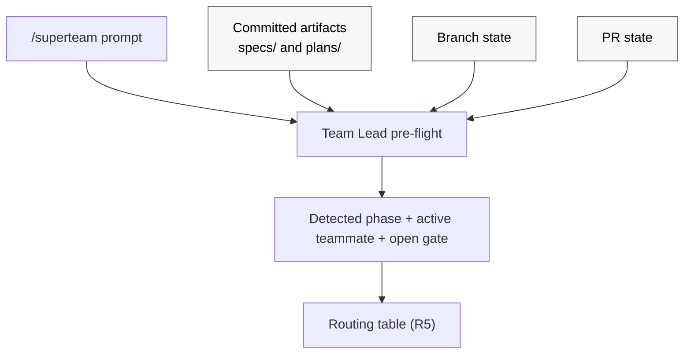

# Design: Superteam: optimize for repeated /superteam invocations and make workflow state more durable [#39](https://github.com/patinaproject/superteam/issues/39)

## Context

Developers using `superteam` have converged on a usage pattern the skill was
not built for: they prefix nearly every instruction with `/superteam` and rely
on the skill to figure out which phase they are in and route the prompt to the
correct teammate. Today `skills/superteam/SKILL.md` has no in-skill memory
between invocations. Phase is re-derived on every call from committed
artifacts (`docs/superpowers/specs/`, `docs/superpowers/plans/`), branch
state, and PR state. Because that re-derivation is not codified, repeated
`/superteam` calls re-enter from the top of `Team Lead` orchestration and may
mis-route, restart phases, or silently skip approval gates.

Symptoms (from issue #39 and observed behavior):

- Repeated `/superteam <new instruction>` calls mid-flow re-enter from the top
  of `Team Lead` orchestration and may mis-route, restart phases, or silently
  skip approval gates (e.g. Gate 1).
- A new instruction arriving mid-`Brainstormer`-approval is sometimes treated
  as a fresh design request rather than as feedback against the pending
  approval packet.
- A new instruction arriving mid-`Executor` may restart planning rather than
  routing as a plan-level or implementation-level loopback.
- Post-PR `Finisher` monitoring loses context across invocations, so a fresh
  `/superteam` call can be confused about whether the workflow is `triage`,
  `monitoring`, `ready`, or `blocked`.
- An ambiguous prompt during a loopback can be reinterpreted as a new top-of-
  workflow request because the skill has no codified phase-detection step.

## Intent

Change `skills/superteam/SKILL.md` so that:

1. Every `/superteam` invocation **must first detect the current phase** from
   already-existing observable signals before doing anything else.
2. Detection reads only artifacts and state that the workflow already
   produces: committed design and plan artifacts, branch state, PR state, and
   the prompt itself. No new persistence layer is introduced.
3. The default behavior on a repeated invocation is **resume and route**, not
   **restart**.
4. New prompts arriving mid-phase are classified explicitly as **resume**,
   **feedback for the active teammate / open gate**, **explicit loopback**,
   or **new top-of-workflow request**, with the routing for each case
   spelled out in `SKILL.md`.
5. When observable state is ambiguous or contradictory, the workflow halts
   with an explicit blocker rather than guessing.

This is a workflow-contract change scoped to a single skill
(`skills/superteam/SKILL.md`). It introduces no new artifact convention, no
new committed state file, and no new persistence surface. `Team Lead`'s
contract is extended to perform phase detection. The existing `Finisher`
state machine (`triage | monitoring | ready | blocked`) stays unchanged in
substance; it is detected from PR/CI signals rather than recorded.

## Requirements

R1. `skills/superteam/SKILL.md` must define a **phase-detection pre-flight**
that runs at the top of every `/superteam` invocation, before routing.

R2. The pre-flight must consult, in this precedence:

  (a) committed design artifacts under `docs/superpowers/specs/` and plan
      artifacts under `docs/superpowers/plans/` for the active issue;
  (b) branch state (current branch name, last commit author / message /
      trailers, recent commit history relevant to the active issue);
  (c) PR state for the active branch (exists, open/closed/merged, latest
      pushed head, required-check status, review thread state);
  (d) the user prompt content itself (issue references, approve/reject
      tokens, requirement-change language, status-check language).

The current phase is derived entirely from these observable signals; no
separate persisted phase record is consulted or written.

R5. `SKILL.md` must add an explicit **routing table** for repeated
invocations. For each `(detected_phase, prompt_classification)` pair, the
table must specify the teammate to route to and the action (resume,
deliver-as-feedback, open-loopback, or new-run). Required rows:

- phase=brainstorm, Gate 1 open, prompt looks like feedback ->
  deliver to `Brainstormer` as delta-only revision; do not restart.
- phase=brainstorm, Gate 1 open, prompt looks like approval ->
  fire Gate 1 approval and route to `Planner`.
- phase=execute, prompt looks like requirement change -> route through
  `Brainstormer` (`spec-level` loopback) per existing loopback rules.
- phase=execute, prompt looks like task adjustment that preserves
  requirements -> route to `Planner` (`plan-level` loopback).
- phase=execute, prompt looks like an implementation question -> route
  to `Executor`.
- phase=finish, detected `Finisher` state in {triage, monitoring, blocked},
  prompt is a status check -> route to `Finisher`; do not restart.
- phase=finish, prompt is requirement-bearing PR feedback -> route
  through `Brainstormer` per existing external-feedback rules.
- phase=halted, prompt is anything -> show the halt reason and require
  explicit operator instruction before resuming.
- any phase, prompt is unambiguously a new top-of-workflow request for a
  different issue -> require explicit operator confirmation before
  starting a new run.

R6. `SKILL.md` must define a **prompt-classification heuristic** with a bias
toward "treat as feedback for the active teammate / open gate" when the
prompt is ambiguous and a phase is in flight. Ambiguous prompts must not
silently start a new phase.

R7. The default for repeated `/superteam` invocations must be **resume**.
"Restart" requires either an explicit operator instruction or an
unambiguous new-issue signal.

R8. **Ambiguous or contradictory observable state** must halt the run with
an explicit blocker per existing `Failure handling` rules. Examples that
must halt:

- the prompt or branch implies `phase=plan` but no design doc exists at
  the canonical specs path.
- the prompt or branch implies `phase=finish` but no PR exists for the
  branch.
- multiple candidate issues are implicated and the active issue cannot
  be resolved unambiguously from prompt + branch.
- committed artifacts on the branch and PR state cannot be reconciled
  into a single coherent phase (e.g. plan doc present and merged PR
  exists for a different issue on the same branch).

Recovery is operator-driven: the operator must clarify the intended
issue, branch, or phase before any teammate work resumes.

R9. `Team Lead` contract must be extended to run the phase-detection
pre-flight before any routing decision and to treat committed artifacts
plus PR state as authoritative when classifying phase and prompt.

R10. `Finisher` contract continues to use its existing state machine
(`triage | monitoring | ready | blocked`). `Finisher` derives current state
from the latest pushed head, required-check status, review thread state, and
its own prior actions in the current session, exactly as it does today.
No new persistence is added.

R12. No `AGENTS.md` change is required for this work; the change is
internal to `skills/superteam/SKILL.md`.

R13. All edits to `skills/superteam/SKILL.md` must go through
`superpowers:writing-skills` with pressure-test walkthroughs covering at
least the canonical cases enumerated in the Pressure Tests section below.

## Approach

### Phase-detection pre-flight

At the top of every `/superteam` invocation, before any teammate
delegation, `Team Lead` runs a deterministic detection sequence:

1. Resolve the active issue from the prompt, branch name, or operator.
2. Inspect committed artifacts:
   - design doc presence and SHA at the canonical specs path
   - plan doc presence and SHA at the canonical plans path
   - latest commit on branch (author, message, trailers, recent history
     touching design / plan / implementation files)
3. Inspect PR state for the branch (exists, open/closed/merged, latest
   pushed head, required-check status, unresolved review threads).
4. Derive `phase` from those observations using a simple rule set:
   - no design doc, no plan, no PR -> `brainstorm`
   - design doc present, no plan, no PR -> `brainstorm` if Gate 1 is
     still open per the most recent commit / approval signal, else
     `plan`
   - plan doc present, no PR -> `execute`
   - PR open or merged -> `finish`, with `Finisher` substate derived
     from PR/CI/review state
   - artifacts and PR state cannot be reconciled into one of the above
     -> halt per R8
5. Classify the incoming prompt under R6.
6. Route per the table in R5.

### Detection inputs in detail

### Prompt classification heuristic

The classifier is a small bulleted decision list in `SKILL.md`:

- If a Gate is detected as open and the prompt does not contain an
  explicit approve/reject token (e.g. `approve`, `reject`, `lgtm`,
  `request changes`), treat as feedback for the gate's owning teammate.
- If `phase=execute` and prompt mentions changing requirements,
  acceptance criteria, or "what we are building", classify as
  `spec-level` loopback.
- If `phase=execute` and prompt mentions changing tasks, sequencing, or
  workstreams without changing requirements, classify as `plan-level`
  loopback.
- If `phase=execute` and prompt is a question about implementation,
  classify as implementation work for `Executor`.
- If `phase=finish` and prompt is a status, "is it done", "check CI"
  type prompt, route to `Finisher` with the existing latest-head sweep.
- If the prompt names a different issue number explicitly, require
  operator confirmation before starting a new run.
- Otherwise, treat the prompt as feedback for the active teammate.

### Resume vs restart

The default is resume. Restart requires one of:

- explicit operator instruction (e.g. `restart`, `start over`, `new run`)
- prompt clearly references a different issue number than the one
  detected from artifacts and branch
- detected `phase=halted` and operator explicitly resumes with a new
  direction

### Approval gates remain authoritative

Phase detection does not weaken Gate 1. The detected `open_gate` reflects
gate state but does not satisfy it. Approval still requires the existing
approval packet (artifact path, intent summary, full requirement set,
`concerns[]`).

## Pressure Tests

The following walkthroughs must pass during `superpowers:writing-skills`
review of any change to `skills/superteam/SKILL.md` produced from this
design.

PT-1. Mid-Brainstormer-approval feedback. Detection shows
`phase=brainstorm`, Gate 1 open (design doc committed, no Gate 1 approval
yet). Operator runs `/superteam tighten the schema, drop the notes field`.
Expected: classified as feedback, delivered to `Brainstormer` as delta-only
revision; design doc not duplicated; gate stays open until explicit
approval.

PT-2. Mid-Executor requirement change. Detection shows `phase=execute`
(plan doc committed, no PR). Operator runs `/superteam we also need to
support unkeyed prompts for non-issue runs`. Expected: classified as
`spec-level` loopback, routed back through `Brainstormer` first per
existing loopback rules.

PT-3. Mid-Executor task adjustment. Detection shows `phase=execute`.
Operator runs `/superteam split the SKILL.md edits into two commits`.
Expected: classified as `plan-level` loopback, routed to `Planner`.

PT-4. Post-PR Finisher monitoring. Detection shows `phase=finish` (PR
exists, required checks pending). Operator runs `/superteam where are we`.
Expected: routed to `Finisher`; `Finisher` runs the latest-head sweep
and reports state; no restart, no new spec, no new plan.

PT-5. Ambiguous prompt during loopback. Detection shows `phase=execute`
with a recent `plan-level` loopback signal in the active session. Operator
runs `/superteam ok`. Expected: treated as feedback for the active
teammate (`Planner`), not as a top-of-workflow request.

PT-6. Ambiguous observable state. Branch claims to be working on issue
number 39 but no design doc exists at the canonical specs path and the PR for
the branch closes a different issue. Expected: halt with
`superteam halted at Team Lead: ambiguous observable state (cannot reconcile branch, artifacts, and PR for active issue)`.

PT-7. New issue mid-run. Detection shows `phase=execute` for issue
number 39. Operator runs `/superteam #41 something different`. Expected:
require explicit operator confirmation before starting a new run; do
not silently switch.

## Out of Scope

- Replacing `superteam` with a stateful agent harness (explicitly
  rejected in the issue's Alternatives).
- Introducing any new persistence layer (committed state file, dotfile,
  PR-body machine-readable block, sidecar JSON, etc.). Phase detection
  must work from already-existing observable state.
- Auto-classifying prompts via an LLM call inside the skill; the
  classifier is intentionally a small deterministic checklist so
  behavior is predictable.
- Cross-issue state aggregation.
- Changes to `AGENTS.md`.
- Changes to the canonical roster, gates, or the loopback class set.
  This design strictly adds detection and routing on top of the existing
  contract.

## Recommended skills for implementation

- `superpowers:writing-skills` (mandatory; this work edits
  `skills/superteam/SKILL.md`).
- `superpowers:writing-plans` (Planner phase).
- `superpowers:test-driven-development` (Executor phase, ATDD against
  the pressure-test walkthroughs above).
- `superpowers:verification-before-completion` (Executor pre-handoff).
- `superpowers:requesting-code-review` and
  `superpowers:receiving-code-review` (Reviewer / Finisher).

## Acceptance criteria

### AC-39-1

`skills/superteam/SKILL.md` adds a phase-detection pre-flight that runs
at the top of every `/superteam` invocation and consults, in order,
committed design and plan artifacts, branch state, PR state, and the
prompt content.

### AC-39-2

`skills/superteam/SKILL.md` adds a routing table covering the
`(detected_phase, prompt_classification)` pairs enumerated in R5,
including explicit handling for resume, deliver-as-feedback,
open-loopback, and new-run cases.

### AC-39-3

`skills/superteam/SKILL.md` defines a prompt-classification heuristic
that defaults to "treat as feedback for the active teammate / open
gate" when a phase is in flight and the prompt is ambiguous, and
defaults repeated invocations to resume rather than restart.

### AC-39-4

`skills/superteam/SKILL.md` requires `Team Lead` to halt with an
explicit blocker when observable state is ambiguous or contradictory
(prompt or branch implies a phase whose required artifact is missing,
multiple candidate issues cannot be disambiguated, or branch artifacts
and PR state cannot be reconciled into a single phase).

### AC-39-5

`Team Lead` contract is extended to run the phase-detection pre-flight
before any routing decision and to treat committed artifacts plus PR
state as authoritative when classifying phase and prompt. `Finisher`
contract is unchanged in substance: it continues to use its existing
`triage | monitoring | ready | blocked` state machine derived from PR
and CI signals.

### AC-39-6

The seven pressure-test walkthroughs (PT-1 through PT-7) pass during
`superpowers:writing-skills` review of the resulting `SKILL.md` change,
and the Reviewer reports pass/fail per workflow-contract rules.
