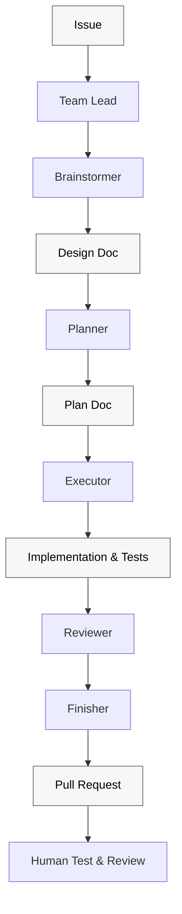
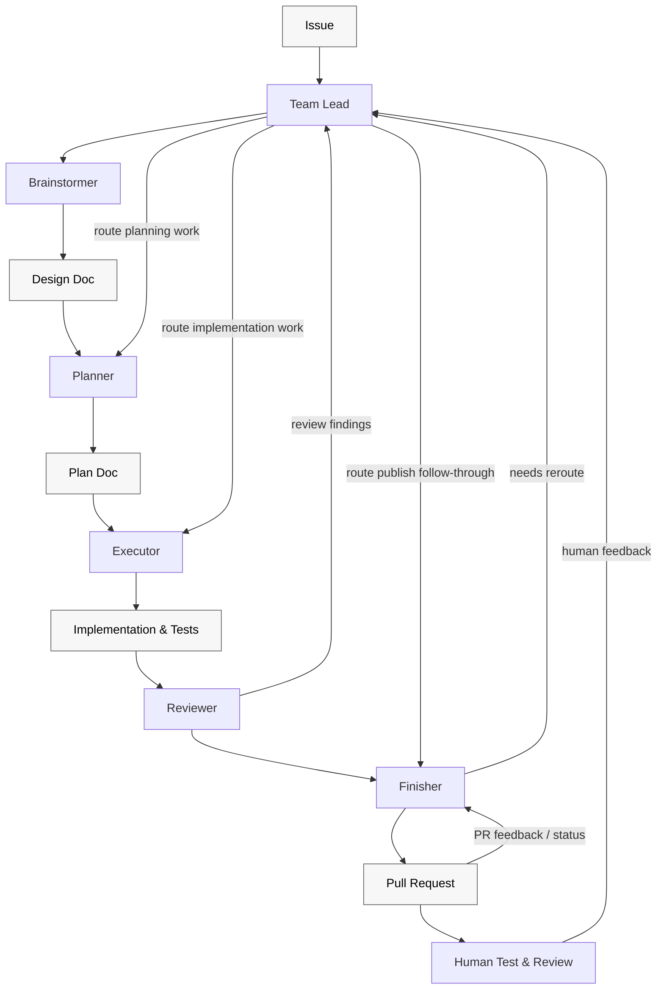

# superteam

`superteam` is an orchestration skill for running a structured issue workflow across a canonical teammate roster. It uses repository-owned artifacts in `skills/` and `docs/` so the workflow stays portable across repositories and runtimes.

## Canonical roster

Use teammate names as the primary organizing language across the workflow:

1. `Team Lead`: owns orchestration, delegation, gates, and loopbacks
2. `Brainstormer`: owns the design doc in `docs/superpowers/specs/`
3. `Planner`: owns the implementation plan in `docs/superpowers/plans/`
4. `Executor`: owns ATDD-driven implementation, code, and tests required by the approved plan
5. `Reviewer`: owns local pre-publish review findings
6. `Finisher`: owns publish-state follow-through, CI, and external feedback handling

The workflow may still reference brainstorm, plan, execute, review, and finish phases, but teammate names are the canonical contract language.

## Workflow Diagrams

The workflow diagrams should stay structurally accurate and easy to read:

- use two Mermaid charts instead of trying to show chronology and orchestration in one diagram
- use only two block types: teammates and artifacts
- keep artifact nodes visually lighter with black text for readability
- keep the chronological chart simple and forward-moving
- keep the orchestration chart top-to-bottom and make `Team Lead` the routing hub for human feedback

Chronological flow:

Orchestration flow:

## Pre-flight

- Prefer the host runtime's normal multi-agent capabilities when available.
- When the host runtime supports background-agent execution for delegated teammate work, prefer using that capability as an execution aid rather than a correctness dependency.
- When the runtime offers durable follow-up features such as thread heartbeats, monitors, or equivalent wakeups, prefer using them for `Finisher` publish-state follow-through while required checks or external review state remain pending.
- Treat these runtime capabilities as aids for the existing teammate and `Finisher` loops, not as separate workflows or replacement contracts.
- Do not block solely because a preferred team feature is unavailable; fall back to direct subagent dispatch.
- If the host lacks those capabilities, do not stop early; continue using the portable teammate and `Finisher` contracts or report an explicit blocker when follow-through cannot safely continue.
- Keep runtime-specific checks lightweight. Teammate ownership, gate discipline, and artifact authority are the important parts.

## Canonical rule discovery

Before any teammate touches governed files, discover the canonical repository rules from repo guidance instead of relying on hard-coded literals:

1. Read root contributor guidance such as `AGENTS.md` when present.
2. Read any local docs that govern the files you will touch.
3. Treat repository guidance as authoritative over remembered workflow shortcuts.

If canonical guidance cannot be found, halt and surface the blocker instead of guessing.

## Gate 1: Brainstormer approval

Advancement from `Brainstormer` to `Planner` requires explicit approval of the design artifact. Silence, ambiguity, or partial replies are non-approval.

Before asking for approval:

1. Verify the design artifact exists at the exact reported path.
2. Return the exact artifact path under review.
3. Include a concise intent summary of what the artifact changes or decides.
4. Include the full requirement set currently under review.
5. Always report `concerns[]` in the approval packet, including an explicit empty result when no approval-relevant concerns remain.
6. Render the operator-facing no-concerns line exactly as `Remaining concerns: None`.
7. Surface any remaining approval-relevant concerns that could materially affect the decision to approve, revise, or narrow the design.

If the approval packet is too large to present cleanly, split it into multiple approval requests or sections. Do not collapse it into a vague fallback summary.

If revisions are requested after an approval pass, re-fire approval with delta-only content:

1. Include only the changed sections or decisions.
2. Include only the requirements changed by those deltas.
3. Keep already-approved content authoritative unless it changed.

## Teammate contracts

### Team Lead

- Route work to the correct teammate.
- Enforce gates and halt on unsatisfied contracts.
- Route requirement-changing deltas back through `Brainstormer`.
- Recommend `superpowers:using-superpowers`.
- Also recommend `superpowers:dispatching-parallel-agents` when splitting independent work.

### Brainstormer

- Own the design doc in `docs/superpowers/specs/`.
- Return the exact design doc path.
- Return the ordered active AC list.
- Report the concise intent summary and the full requirement set used for approval.
- Always report `concerns[]` when requesting approval, including an explicit empty result when no approval-relevant concerns remain under the contract.
- Render the operator-facing no-concerns line exactly as `Remaining concerns: None`.
- Surface any remaining approval-relevant concerns when requesting approval.
- Recommend `superpowers:brainstorming`.

### Planner

- Consume the approved design doc, not ad hoc chat summaries.
- Produce the implementation plan or halt with a blocker.
- Recommend `superpowers:writing-plans`.

### Executor

- Drive implementation from acceptance criteria and approved plan tasks using ATDD, not ad hoc coding first.
- Implement only the assigned tasks from the approved plan.
- Report completion against explicit task IDs.
- Include concrete completion evidence, SHAs, and verification evidence before claiming completion.
- `Executor` completion is not workflow completion. After local implementation work is complete, the run must either continue into `Reviewer` and then `Finisher`, or halt explicitly as `superteam halted at <teammate or gate>: <reason>`.
- Never push, rebase, or open a PR.
- Recommend `superpowers:test-driven-development` as the ATDD execution skill.
- Recommend `superpowers:systematic-debugging` when debugging or failures appear.
- Recommend `superpowers:writing-skills` when touching `skills/**/*.md`.
- Recommend `superpowers:verification-before-completion` before claiming completion.

### Reviewer

- Review locally before publish.
- Validate artifact ownership, required verification, and role-rule compliance.
- Classify loopbacks explicitly as `implementation-level`, `plan-level`, or `spec-level`.
- Own receiving and interpreting local pre-publish review findings.
- Recommend `superpowers:requesting-code-review` for first-pass local review.
- Also recommend `superpowers:receiving-code-review` when analyzing existing or disputed findings before publish.
- When reviewing changes to `skills/**/*.md` or workflow-contract docs, invoke `superpowers:writing-skills` and run the relevant pressure-test walkthrough before publish.
- If later fixes change those same workflow-contract surfaces again after an earlier review pass, rerun the relevant pressure-test walkthrough before handing the run back to `Finisher`.
- Report pressure-test pass/fail results and any loopholes found for skill or workflow-contract changes.
- Keep findings local; do not take ownership of external review feedback.

### Finisher

- Own push, branch publication, PR updates, PR body rendering, CI triage, and external review/comment handling.
- Own receiving and interpreting external post-publish PR feedback.
- Report pushed SHAs, current branch state on origin, PR state, and CI state.
- When a project-owned PR template or PR-body rule exists, satisfy it first and treat the `superteam` PR template as fallback/default guidance rather than as an override.
- When a real issue number is available for the canonical single-issue workflow and nothing in the current run says the work is partial, follow-up, or otherwise non-closing, render `Closes #<issue-number>` in the PR body.
- When the issue is related but the run is not issue-completing, render a non-closing issue reference plus a brief explanation.
- When no issue number is present, omit the issue-reference line entirely.
- Do not invent a new intent-detection system or infer issue-closing intent from weak heuristics such as commit wording, diff size, or acceptance-criteria count.
- Every `superteam` run is expected to publish a PR; local-only state is never a valid completion, demo, or handoff state.
- Push the branch and create or update the PR before treating the run as being in publish-state follow-through.
- Treat publish-state on the latest pushed head as an explicit `Finisher` state machine:
  1. `triage`
  2. `monitoring`
  3. `ready`
  4. `blocked`
- When required checks on the latest pushed head are still pending after immediate branch-side fixes are complete, stay in `monitoring` rather than presenting the run as complete.
- If later required checks fail while monitoring, re-enter `triage` automatically on the latest pushed head.
- If later required checks pass while monitoring, allow `ready` only after the rest of the latest-head publish-state sweep is also clear.
- If pending external systems still block readiness and the workflow cannot safely continue monitoring, report an explicit `blocked` state instead of using a completion-style summary.
- Any new push invalidates earlier assumptions and restarts evaluation on the new latest head.
- Stay in the `Finisher` loop after PR publication until publish-state follow-through is stable enough to hand off cleanly or an explicit blocker is reported.
- Do not treat PR creation, one status snapshot, restored mergeability, or green CI alone as workflow completion.
- When the runtime offers durable follow-up features such as thread heartbeats, monitors, or equivalent wakeups, prefer using them while required checks or external review state remain pending.
- Treat those runtime features as aids for the same latest-head `Finisher` loop rather than as a separate workflow or replacement contract.
- If the runtime lacks those features, continue the portable `Finisher` ownership model or report an explicit blocker instead of stopping early.
- Verify current branch state before resolving or replying to comments tied to prior state.
- Route requirement-bearing feedback through `Brainstormer` first, then `Planner`, then `Executor`.
- Recommend `superpowers:finishing-a-development-branch`.
- Also recommend `superpowers:receiving-code-review` when handling PR comments, review threads, or bot feedback after publish.

## Missing skill warnings

When `Team Lead` delegates work, the prompt must explicitly recommend the expected `superpowers` skills for that role when relevant. If an expected skill is unavailable in the current environment, say so explicitly in the delegated prompt so both the operator and teammate can see the gap.

Do not silently omit expected skill guidance.

## Review and loopback routing

Loopbacks must be explicit:

1. `implementation-level` findings route to `Executor`
2. `plan-level` findings route to `Planner`
3. `spec-level` findings route to `Brainstormer`

Requirement-bearing feedback does not route straight to implementation. It returns to `Brainstormer`, then to `Planner`, and only then back to `Executor`.

Implementation-detail deltas that preserve requirements, ownership, and acceptance intent may route directly to `Planner`.

Review interpretation happens at the intake point for that feedback:

- `Reviewer` receives and classifies local pre-publish findings
- `Finisher` receives and classifies external post-publish PR feedback
- `Brainstormer`, `Planner`, and `Executor` own remediation after routing rather than primary review intake

## External feedback ownership

External PR comments, review threads, bot findings, and other repository feedback remain owned by `Finisher`, even when local `Reviewer` findings already exist.

Before resolving or replying to comments tied to a prior branch state:

1. Verify the current branch state against the state the comment referred to.
2. Do not respond as if nothing changed when the comment no longer matches the current branch.
3. Re-route requirement-bearing feedback through the spec-first path.

## Rationalization table

| Excuse | Reality |
|--------|---------|
| "The design file probably exists if Brainstormer says it does." | Gate 1 requires verifying the artifact exists at the reported path before approval. |
| "I can summarize the approval request in one short fallback blurb." | Approval packets must include artifact path, concise intent summary, and full requirement set; split oversized packets instead of collapsing them. |
| "I can replay the whole approval request after a small revision." | Re-fired approval after revisions must be delta-only. |
| "If the runtime has background agents or wakeups, the contract must require them." | Runtime capabilities are execution aids for the portable workflow, not correctness dependencies. |
| "I remember the repo rules already." | Discover canonical repository guidance before touching governed files. |
| "Executor finished the spirit of the task." | `Executor` must report completion against explicit task IDs with evidence. |
| "Reviewer can just send everything back to execution." | `Reviewer` must classify implementation-level, plan-level, and spec-level loopbacks. |
| "Reviewer already found it, so Reviewer can own PR comment handling too." | External review feedback stays with `Finisher`. |
| "That comment is old, but I can still resolve it." | `Finisher` must verify current branch state before resolving prior-state comments. |

## Red flags

- Using older stage-only language where the canonical teammate roster should be used.
- Asking for design approval before verifying the cited artifact exists.
- Approval requests that omit the artifact path, concise intent summary, or full requirement set.
- Approval requests that omit `concerns[]` or render the no-concerns case as anything other than `Remaining concerns: None`.
- Oversized approval requests collapsed into a vague summary instead of split into clean sections.
- Approval requests that hide real approval-relevant concerns.
- Replaying already-approved content instead of sending delta-only approval after revisions.
- Touching governed files without canonical-rule discovery from repository guidance.
- Delegated teammate work in a runtime-capable host that ignores available background-agent execution without justification.
- Delegated teammate prompts that omit expected `superpowers` recommendations or fail to warn when an expected skill is unavailable.
- `Executor` claiming completion without explicit task IDs, SHAs, or verification evidence.
- `Reviewer` failing to classify findings as `implementation-level`, `plan-level`, or `spec-level`.
- Local pre-publish review findings routed through `Finisher` instead of `Team Lead`.
- Skill or workflow-contract changes reviewed without `superpowers:writing-skills` or a pressure-test walkthrough.
- Local review findings taking ownership of external PR feedback away from `Finisher`.
- `Finisher` resolving prior-state comments without checking current branch state first.
- `Finisher` treating missing runtime wakeups as permission to stop early or present a completion-style handoff.
- Treating local-only state as a valid end state for a `superteam` run.
- Letting a run stop with a completion-style closeout after `Executor` finishes local work without reaching `Reviewer` and `Finisher`, unless the run halts explicitly with a blocker.
- Treating PR publication plus a status snapshot as the end of the workflow while `Finisher`-owned work is still active.
- Shutting down with unresolved review threads or other blocking external PR feedback still open.

## Shutdown

Shutdown is a success-only action. Do not shut down or present the run as complete unless every required shutdown check passes on the latest pushed PR state.

Every `superteam` run is expected to publish a PR. Local-only state is never a valid complete, demoable, or handoffable result.

PR publication is a milestone, not the end of the workflow. `Finisher` remains active after the PR exists and after any individual status snapshot until the publish-state follow-through is stable or an explicit blocker is reported.

Shutdown readiness is head-relative. After every push, `Finisher` must re-evaluate completion against the latest PR head instead of relying on a prior green or previously-cleared state.

Before shutdown:

1. Verify the current branch has been pushed and the active PR exists.
2. Verify the active PR and the current branch state after the latest push.
3. Verify current publish-state blockers for the latest pushed state, including mergeability, required checks, and PR metadata requirements discovered from repository rules.
4. Check unresolved inline review threads on the latest PR head.
5. Check recent blocking external PR feedback on the latest pushed state.
6. Treat the following as blocking:
   - an unpushed branch or missing PR
   - broken mergeability or required publish-state follow-through that `Finisher` still owns
   - required checks that are pending or failing without a clear handoff-ready blocker report
   - PR metadata or title failures that violate repository rules and still require `Finisher` action
   - unresolved inline review threads on the latest PR head
   - unresolved reviewer or bot feedback posted after the latest push that requests a code change, verification rerun, follow-up response, or other concrete corrective action before the PR is ready
7. Record the final unresolved blocking-feedback counts for the latest pushed state, including:
   - unresolved inline review threads
   - unresolved top-level reviewer or bot comments with still-applicable findings or requested corrective action
8. Treat any nonzero unresolved blocking-feedback count as a blocker.
9. Only dedupe a top-level comment from the final unresolved count when it is explicitly a summary of specific inline findings already audited on the latest pushed state.
10. Treat every new push as invalidating prior completeness assumptions. Re-check review state, checks, mergeability, and PR metadata against the latest pushed head before reporting success.
11. If blocking work remains, continue the `Finisher` loop, dispatch `Finisher`-owned handling, and re-check instead of stopping at a status snapshot.
12. If the state cannot be determined safely, distinguish branch-caused blockers from likely baseline or unrelated failures when possible, and prompt the operator instead of guessing.
13. Report the remaining blocking state explicitly, including the final unresolved blocking-feedback counts, before any handoff or halt.
14. Only request shutdown when every required shutdown check passes on the latest pushed head. Otherwise halt with an explicit blocker.

Use repository placeholders such as `<owner>`, `<repo>`, `<pr>`, and `<branch>` in commands so the workflow stays portable across repositories.

## Failure handling

Any unsatisfied gate or failed teammate contract should halt the run and report:

`superteam halted at <teammate or gate>: <reason>`

Do not silently continue past failed checks, missing artifacts, ambiguous repository state, or unresolved publish-state feedback.

## Supporting files

- [agent-spawn-template.md](./agent-spawn-template.md): teammate-specific spawn guidance
- [pr-body-template.md](./pr-body-template.md): PR checklist template used by `Finisher`
