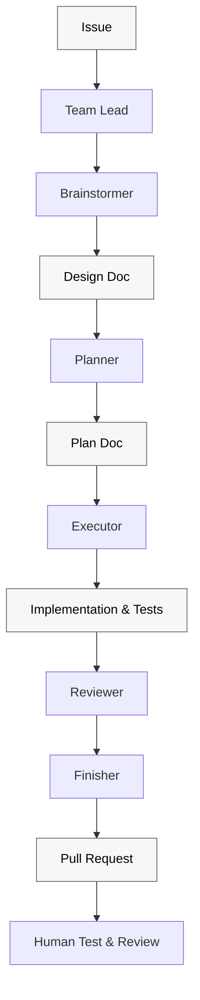
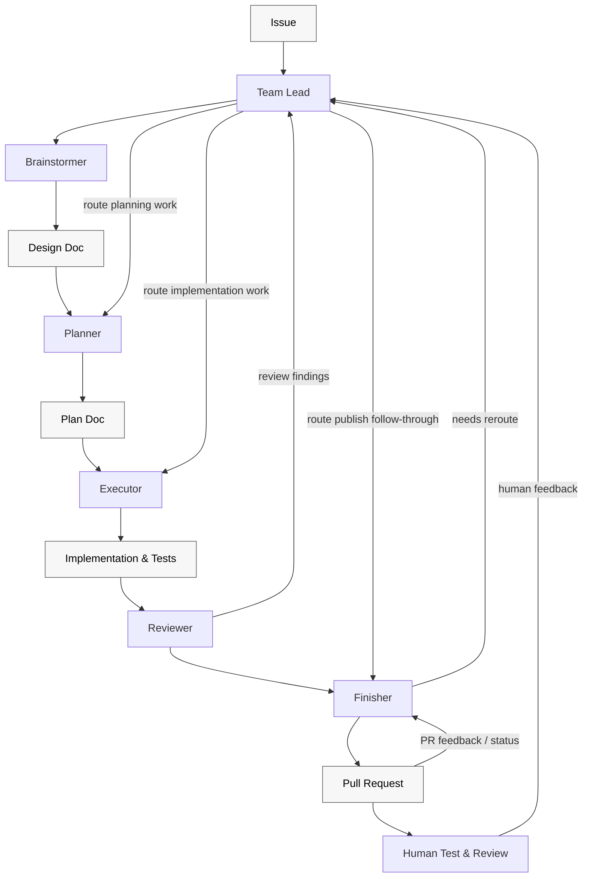

# superteam

`superteam` is an orchestration skill for running a structured issue workflow across a canonical teammate roster. It uses repository-owned artifacts in `skills/` and `docs/` so the workflow stays portable across repositories and runtimes.

## Canonical roster

Use teammate names as the primary organizing language across the workflow:

1. `Team Lead`: owns orchestration, delegation, gates, and feedback routing
2. `Brainstormer`: owns the design doc in `docs/superpowers/specs/`
3. `Planner`: owns the implementation plan in `docs/superpowers/plans/`
4. `Executor`: owns ATDD-driven implementation, code, and tests required by the approved plan
5. `Reviewer`: owns local pre-publish review findings
6. `Finisher`: owns publish-state follow-through, CI, and external feedback handling

The workflow may still reference brainstorm, plan, execute, review, and finish phases, but teammate names are the canonical contract language.

## Workflow Diagrams

The workflow diagrams should stay structurally accurate and easy to read:

- use two Mermaid charts instead of trying to show chronology and orchestration in one diagram
- use only two block types: teammates and artifacts
- keep artifact nodes visually lighter with black text for readability
- keep the chronological chart simple and forward-moving
- keep the orchestration chart top-to-bottom and make `Team Lead` the routing hub for human feedback

Chronological flow:

Orchestration flow:

## Pre-flight

### Phase-detection and execution-mode pre-flight

At the top of every `/superteam` invocation, before any teammate delegation, `Team Lead` runs a deterministic detection sequence covering both phase detection and execution-mode capability detection. See `pre-flight.md` in this skill directory for the full algorithm.

Summary of the sequence:

- Resolve the active issue (explicit `#<n>` in prompt, then branch `<n>-<slug>`, then operator).
- Inspect committed artifacts on the branch (design doc, plan doc) at the canonical specs and plans paths.
- Inspect PR state on origin (open / merged / absent).
- Derive the detected phase per the rules below.
- Classify the operator prompt per `routing-table.md`.
- Resolve execution mode per `pre-flight.md` `## Execution-mode capability detection`, then route per `routing-table.md`.

Phase derivation rules:

- no design doc, no plan, no PR -> `brainstorm`
- design doc present, no plan doc on branch, no PR -> `brainstorm` (Gate 1 still open per R15)
- plan doc present on branch, no PR -> `execute`
- PR open or merged -> `finish`, with `Finisher` substate derived from PR / CI / review state
- artifacts and PR state cannot be reconciled -> halt per `pre-flight.md` `## Halt conditions`

When observable state is ambiguous or contradictory per `pre-flight.md` halt conditions, halt with `superteam halted at Team Lead: <reason>` per `## Failure handling`.

Execution-mode capability probing is part of this pre-flight. See `pre-flight.md` section `## Execution-mode capability detection` for the deterministic probe order, and `## Execution-mode injection` below for delegation-time injection. Missing execution capability halts only when the selected route requires execute-phase delegation; non-execute routes continue through their owning teammate.

- Prefer the host runtime's normal multi-agent capabilities when available.
- When the host runtime supports background-agent execution for delegated teammate work, prefer using that capability for bounded, independent work that is unlikely to need live clarification, as an execution aid rather than a correctness dependency.
- Keep tightly coupled, ambiguity-heavy, or clarification-driven teammate work in the foreground even when background agents are available.
- When the runtime offers durable follow-up features such as thread heartbeats, monitors, or equivalent wakeups, prefer using them for `Finisher` publish-state follow-through while required checks or external review state remain pending.
- In Codex app environments, same-thread automations are the native fit when `Finisher` follow-through should stay attached to the current conversation.
- Treat these runtime capabilities as aids for the existing teammate and `Finisher` loops, not as separate workflows or replacement contracts.
- Do not block solely because a preferred team feature is unavailable; fall back to direct subagent dispatch.
- If the host lacks those capabilities, do not stop early; continue using the portable teammate and `Finisher` contracts or report an explicit blocker when follow-through cannot safely continue.
- Keep runtime-specific checks lightweight. Teammate ownership, gate discipline, and artifact authority are the important parts.

## Execution-mode injection

`Team Lead` probes execution capability during pre-flight (per `pre-flight.md` `## Execution-mode capability detection`) and binds every execute-phase delegation to the resolved mode at delegation time. If no execution mode is available, halt only when the selected route requires execute-phase delegation.

Rule (R14):

- Prefer **team mode** when `Team Lead` recorded that capability as available during pre-flight (per R17). In team mode, `Team Lead` invokes the host's native team-mode capability directly.
- Otherwise fall back to **subagent-driven** by invoking `superpowers:subagent-driven-development` directly. Delegation prompts in this mode MUST NOT instruct the teammate to invoke `superpowers:executing-plans`.
- **Never auto-select inline.** Inline is only reachable when the operator explicitly overrides the default with an unambiguous token (`inline`, `run inline`, `execute in this session`); only an explicit override may route through `superpowers:executing-plans`.
- Missing team-mode or subagent-driven capability does not block non-execute routes such as approval, review, or `Finisher` status checks. It blocks only routes that need execute-phase delegation.

Team Lead duties (R14):

- Detect host-runtime team-mode capability up front in pre-flight, alongside phase detection (extending `## Pre-flight` capability checks per `pre-flight.md`), using the deterministic detection rule in R17.
- Bind every execution-phase delegation to the chosen execution-mode skill **directly** (`superpowers:subagent-driven-development` for the subagent path, or the host's native team-mode capability for the team path). The delegation MUST NOT name `superpowers:executing-plans` as the entry skill when the resolved mode is `team mode` or `subagent-driven`.
- Inject the pre-selected execution mode into every execution-phase delegation prompt so the developer is not prompted to choose.
- State the resolved mode in the delegation prompt and instruct the teammate not to ask the operator to choose between subagent-driven and inline execution. Carry the same suppression wording into any nested delegation the teammate performs for the same execution batch.

Operator override:

An explicit `inline` (or equivalent: `run inline`, `execute in this session`) instruction in the prompt switches the resolved mode to inline for that delegation only, and is the only path that may route through `superpowers:executing-plans`. Ambiguous "inline-ish" / "faster" / "forever" framing is NOT an override.

## Canonical rule discovery

Before any teammate touches governed files, discover the canonical repository rules from repo guidance instead of relying on hard-coded literals:

1. Read root contributor guidance such as `AGENTS.md` when present.
2. Read any local docs that govern the files you will touch.
3. Treat repository guidance as authoritative over remembered workflow shortcuts.

If canonical guidance cannot be found, halt and surface the blocker instead of guessing.

## Skill-quality review loop

When a run changes `skills/superteam/SKILL.md`, adjacent `skills/superteam/*.md` workflow-contract files, or repo-owned pressure tests for this workflow, use `skill-quality-review.md` as the local adaptation of Trail of Bits workflow-skill review and skill-improver discipline.

This loop feeds Superteam's normal teammate workflow. It does not replace `Brainstormer`, `Planner`, `Executor`, `Reviewer`, or `Finisher`.

Required outcomes:

- Record each finding with severity, affected surface, disposition, and verification evidence.
- Fix or explicitly disposition every critical and major finding before publish.
- Evaluate minor findings for usefulness before applying them.
- Preserve local contracts when external skill-review guidance conflicts with Superteam.
- Keep review evidence in durable artifacts, PR acceptance criteria, or other inspectable records rather than volatile chat context.

## Artifact handoff authority

Handoffs that depend on uncommitted durable artifact changes are incomplete unless the run halts explicitly with a blocker.

For artifact-producing handoffs, the workflow should trust committed branch state rather than dirty workspace state. Downstream teammates should be able to rely on inspectable commits instead of inferring intent from uncommitted local changes.

## Operator-facing output

Superteam chat output should satisfy workflow invariants rather than render a fixed status-report template by default. Teammates should write the shortest natural response that makes the current state, requested operator action, active blocker, or next step clear.

Structured bullets and headings are allowed when they help the operator act. They are not mandatory report shells.

Separate durable workflow data from chat rendering:

- Keep required evidence, done-report fields, review findings, AC verification, loopback state, PR state, and shutdown evidence in durable artifacts, explicit handoff data, PR surfaces, or other inspectable records when downstream teammates or future sessions depend on them.
- Do not rely on volatile agent context as the only home for required evidence.
- Do not dump every durable field into the operator-facing response unless those fields affect the current decision.
- Surface active blockers, active findings, requested approvals, requested feedback, and next steps clearly.
- Do not enumerate closed, resolved, or dispositioned findings in normal operator-facing output unless they affect the current operator decision.

## Gate 1: Brainstormer approval

Advancement from `Brainstormer` to `Planner` requires explicit approval of the design artifact. Silence, ambiguity, or partial replies are non-approval.

Before asking for approval:

1. Verify the design artifact exists at the exact reported path.
2. Return the exact artifact path under review.
3. Include a concise intent summary of what the artifact changes or decides.
4. Include the full requirement set currently under review.
5. Include `adversarial_review_findings[]` as the single approval-finding surface, including Brainstormer-originated concerns and adversarial-review findings.
6. Preserve finding provenance with `source: brainstormer | adversarial-review`.
7. Require an explicit adversarial-review result before approval can advance: `clean`, `findings dispositioned`, or `blocked`.
8. Include `reviewer_context`: `fresh subagent`, `parallel specialists`, or `same-thread fallback`.
9. Include `clean_pass_rationale` with checked dimensions when no blocker or material findings remain.
10. Halt approval when any blocker or material finding is still open.

The evidence above is required gate data, not a required chat template. The operator-facing approval request should read naturally and focus on the decision being requested. It may summarize a clean review as no approval-blocking findings remaining instead of replaying closed or dispositioned findings.

Before Gate 1 approval is presented, `Team Lead` must run or dispatch an adversarial design review against the committed design artifact. Fresh-context or parallel specialist review is preferred for workflow-critical or broad designs when the runtime supports it; same-thread review is the portable fallback. Brainstormer-originated findings alone do not satisfy this gate.

For designs that touch `skills/**/*.md` or any workflow-contract surface, the adversarial review must check the `superpowers:writing-skills` dimensions: RED/GREEN baseline obligations, rationalization resistance, red flags, token-efficiency targets, role ownership, and stage-gate bypass paths.

If adversarial review changes the design, `Brainstormer` must commit the revised artifact before approval. Material requirement, ownership, pressure-test, or gate-order changes require rerunning the affected review dimensions or recording why rerun is unnecessary.

If the approval packet is too large to present cleanly, split it into multiple approval requests or sections. Do not collapse it into a vague fallback summary.

If revisions are requested after an approval pass, re-fire approval with delta-only content:

1. Include only the changed sections or decisions.
2. Include only the requirements changed by those deltas.
3. Keep already-approved content authoritative unless it changed.

## Routing table

Every `/superteam` invocation, after pre-flight, routes via an explicit `(detected_phase, prompt_classification)` table. See `routing-table.md` in this skill directory for the complete table, prompt-classification heuristic, resume-not-restart default, and Gate 1 durability rule.

Headline behaviors:

- Default for repeated `/superteam` invocations is **resume**, not restart (R7).
- Ambiguous prompts during an open gate or in-flight phase are classified as **feedback for the active teammate**, never as silent phase advance (R6).
- **Gate 1 is durably observable iff a plan doc has been committed on the branch.** Prior in-session "approve" without a committed plan doc is treated as not-yet-approved on subsequent invocations (R15).

## Teammate contracts

### Team Lead

- Run the phase-detection and execution-mode pre-flight (see `pre-flight.md` in this skill directory) before any routing decision.
- Treat committed artifacts plus PR state as authoritative when classifying phase and prompt; do not infer phase from in-session memory.
- Halt with `superteam halted at Team Lead: <reason>` when observable state is ambiguous or contradictory; do not "pick the most likely interpretation".
- Route work to the correct teammate.
- Enforce gates and halt on unsatisfied contracts.
- Route requirement-changing deltas back through `Brainstormer`.
- Before Gate 1 approval can advance, enforce adversarial design review against the committed design artifact.
- Include `adversarial_review_status`, `reviewer_context`, `adversarial_review_findings[]`, and `clean_pass_rationale` when applicable in Gate 1 approval packets.
- Treat Brainstormer-originated findings as useful input but not proof that adversarial review occurred.
- Render operator-facing handoffs as natural prose that satisfies the current workflow invariants instead of dumping every internal field as a status report.
- Keep required gate and handoff evidence durable even when the chat response is concise.
- Surface only findings that require current operator feedback; keep resolved finding history in artifacts or explicit handoff data.
- Recommend `superpowers:using-superpowers`.
- Also recommend `superpowers:dispatching-parallel-agents` when splitting bounded, independent work, and keep tightly coupled or interactive steps in the foreground.
- During execute-phase delegation, bind directly to the chosen execution-mode skill (`superpowers:subagent-driven-development` for subagent-driven, or the host's native team-mode capability for team mode). Do NOT route execute-phase delegations through `superpowers:executing-plans` on default paths.
- Inject the pre-selected execution mode (resolved per R17 in pre-flight) into every execute-phase delegation prompt and instruct the teammate not to ask the operator to choose between subagent-driven and inline execution. Carry the same suppression wording into any nested delegation.
- Treat ambiguous "inline-ish" / "faster" / "forever" framing as NOT an explicit operator override. Inline is reachable only via unambiguous tokens (`inline`, `run inline`, `execute in this session`).

### Brainstormer

- Own the design doc in `docs/superpowers/specs/`.
- Commit the design artifact change before reporting done or handing off to `Planner`.
- Return the exact design doc path.
- Return the ordered active AC list.
- Report the concise intent summary and the full requirement set used for approval.
- Report `adversarial_review_findings[]` when requesting approval, including Brainstormer-originated concerns and adversarial-review findings.
- Preserve `source: brainstormer | adversarial-review` on every finding.
- Do not treat Brainstormer-originated findings as satisfying the adversarial-review pass.
- Include reviewer context and checked dimensions in the clean-pass rationale when the adversarial-review result is clean.
- Commit any design changes caused by self-review or adversarial findings before reporting done or handing off to `Planner`.
- Include the handoff commit SHA for the committed design artifact in the done report.
- Separate durable done-report or review data from operator-facing prose; the data must remain inspectable, but the chat handoff should be as natural and decision-focused as the situation allows.
- Determine the intended surface from the issue before authoring requirements. When the design under brainstorming will touch `skills/**/*.md` or any workflow-contract surface (the `superteam` skill itself, agent-spawn templates, PR-body templates, or other repository-owned workflow contracts), invoke `superpowers:writing-skills` BEFORE authoring requirements. If the issue plausibly targets those surfaces and the exact files are uncertain, invoke `superpowers:writing-skills` first or halt for clarification. This is unconditional on the trigger, not "consider"; once the design touches or plausibly targets a skill or workflow-contract surface, writing-skills is the load-bearing reference for what the design must contain (loophole-closure language, rationalization-table rows, red-flags bullets, token-efficiency targets, RED-phase baseline obligation). A `Brainstormer` who skips writing-skills at design time forces every downstream teammate to re-derive it. Not even when an authority claim is cited. Not even under deadline pressure.
- Recommend `superpowers:brainstorming`.

### Planner

- Consume the approved design doc, not ad hoc chat summaries.
- Commit the implementation plan change before reporting done or handing off to `Executor`.
- Produce the implementation plan or halt with a blocker.
- Include the handoff commit SHA for the committed implementation plan in the done report.
- Separate durable done-report or review data from operator-facing prose; the data must remain inspectable, but the chat handoff should be as natural and decision-focused as the situation allows.
- Recommend `superpowers:writing-plans`.

### Executor

- Drive implementation from acceptance criteria and approved plan tasks using ATDD, not ad hoc coding first.
- Implement only the assigned tasks from the approved plan.
- Commit the completed implementation and test changes before reporting done or handing off to `Reviewer`.
- Report completion against explicit task IDs.
- Include concrete completion evidence, SHAs, and verification evidence before claiming completion.
- Separate durable done-report or review data from operator-facing prose; the data must remain inspectable, but the chat handoff should be as natural and decision-focused as the situation allows.
- `Executor` completion is not workflow completion. After local implementation work is complete, the run must either continue into `Reviewer` and then `Finisher`, or halt explicitly as `superteam halted at <teammate or gate>: <reason>`.
- Never push, rebase, or open a PR.
- Recommend `superpowers:test-driven-development` as the ATDD execution skill.
- Recommend `superpowers:systematic-debugging` when debugging or failures appear.
- Recommend `superpowers:writing-skills` when touching `skills/**/*.md`.
- When implementing a workflow-contract change, produce or update the issue-specific review evidence required by `skill-quality-review.md`.
- Recommend `superpowers:verification-before-completion` before claiming completion.

### Reviewer

- Review locally before publish.
- Validate artifact ownership, required verification, and role-rule compliance.
- Classify feedback explicitly as `implementation-level`, `plan-level`, or `spec-level`.
- Own receiving and interpreting local pre-publish review findings.
- Recommend `superpowers:requesting-code-review` for first-pass local review.
- Also recommend `superpowers:receiving-code-review` when analyzing existing or disputed findings before publish.
- When reviewing changes to `skills/**/*.md` or workflow-contract docs, invoke `superpowers:writing-skills` and run the relevant pressure-test walkthrough before publish.
- For Superteam workflow-contract changes, apply `skill-quality-review.md` before publish and verify critical/major findings are fixed or dispositioned.
- Evaluate minor findings for usefulness instead of applying them blindly.
- Treat the Trail of Bits-inspired review loop as evidence for local review, not as a replacement for local review ownership.
- If later fixes change those same workflow-contract surfaces again after an earlier review pass, rerun the relevant pressure-test walkthrough before handing the run back to `Finisher`.
- Report pressure-test pass/fail results and any loopholes found for skill or workflow-contract changes.
- Report local findings with `feedback_classification` (`implementation-level` | `plan-level` | `spec-level`) and an owner before routing.
- Separate durable done-report or review data from operator-facing prose; the data must remain inspectable, but the chat handoff should be as natural and decision-focused as the situation allows.
- Keep findings local; do not take ownership of external review feedback.

### Finisher

- Own push, branch publication, PR updates, PR body rendering, CI triage, and external review/comment handling.
- Own receiving and interpreting external post-publish PR feedback.
- Report pushed SHAs, current branch state on origin, PR state, and CI state.
- Separate durable done-report or review data from operator-facing prose; the data must remain inspectable, but the chat handoff should be as natural and decision-focused as the situation allows.
- Natural prose must not hide publish-state blockers, pending checks, unresolved review feedback, or shutdown evidence.
- When a project-owned PR template or PR-body rule exists, satisfy it first and treat the `superteam` PR template as fallback/default guidance rather than as an override.
- When a real issue number is available for the canonical single-issue workflow and nothing in the current run says the work is partial, follow-up, or otherwise non-closing, render `Closes #<issue-number>` in the PR body.
- When the issue is related but the run is not issue-completing, render a non-closing issue reference plus a brief explanation.
- When no issue number is present, omit the issue-reference line entirely.
- Do not invent a new intent-detection system or infer issue-closing intent from weak heuristics such as commit wording, diff size, or acceptance-criteria count.
- Every `superteam` run is expected to publish a PR; local-only state is never a valid completion, demo, or handoff state.
- Push the branch and create or update the PR before treating the run as being in publish-state follow-through.
- Treat publish-state on the latest pushed head as an explicit `Finisher` state machine:
  1. `triage`
  2. `monitoring`
  3. `ready`
  4. `blocked`
- When required checks on the latest pushed head are still pending after immediate branch-side fixes are complete, stay in `monitoring` rather than presenting the run as complete.
- If later required checks fail while monitoring, re-enter `triage` automatically on the latest pushed head.
- If later required checks pass while monitoring, allow `ready` only after the rest of the latest-head publish-state sweep is also clear.
- If pending external systems still block readiness and the workflow cannot safely continue monitoring, report an explicit `blocked` state instead of using a completion-style summary.
- Any new push invalidates earlier assumptions and restarts evaluation on the new latest head.
- Stay in the `Finisher` loop after PR publication until publish-state follow-through is stable enough to hand off cleanly or an explicit blocker is reported.
- Do not treat PR creation, one status snapshot, restored mergeability, or green CI alone as workflow completion.
- When the runtime offers durable follow-up features such as thread heartbeats, monitors, or equivalent wakeups, prefer using them while required checks or external review state remain pending.
- In Codex app environments, prefer a thread automation attached to the current thread when the goal is to preserve the same `Finisher` context while waiting on external publish-state.
- Treat those runtime features as aids for the same latest-head `Finisher` loop rather than as a separate workflow or replacement contract.
- Durable follow-up payloads must include enough state to resume the same `Finisher` loop: branch, PR, latest pushed SHA, current publish-state, pending signals, and the instruction to resume the latest-head shutdown checklist.
- If the runtime lacks those features, continue the portable `Finisher` ownership model or report an explicit blocker instead of stopping early.
- Verify current branch state before resolving or replying to comments tied to prior state.
- Route requirement-bearing feedback through `Brainstormer` first, then `Planner`, then `Executor`.
- Recommend `superpowers:finishing-a-development-branch`.
- Also recommend `superpowers:receiving-code-review` when handling PR comments, review threads, or bot feedback after publish.

## Missing skill warnings

When `Team Lead` delegates work, the prompt must explicitly recommend the expected `superpowers` skills for that role when relevant. If an expected skill is unavailable in the current environment, say so explicitly in the delegated prompt so both the operator and teammate can see the gap.

Do not silently omit expected skill guidance.

## Done-report contracts

Artifact-producing teammate done reports must anchor on committed handoff state rather than uncommitted workspace state.

### Brainstormer done report

- `design_doc_path`: exact path to the written design doc
- `ac_ids[]`: ordered list of active AC IDs
- `intent_summary`: concise summary of what the artifact changes or decides
- `requirements[]`: full requirement set currently under review
- `adversarial_review_status`: `clean` | `findings dispositioned` | `blocked`
- `reviewer_context`: `fresh subagent` | `parallel specialists` | `same-thread fallback`
- `adversarial_review_findings[]`: findings relevant to approval, with `source`, `severity`, `location`, `finding`, and `disposition`
- `clean_pass_rationale`: required with checked dimensions when no blocker or material findings remain
- `handoff_commit_sha`: commit containing the design artifact used for approval and planning

### Planner done report

- `plan_path`: exact path to the written implementation plan
- `workstreams[]`: short summary of planned batches or workstreams
- `blockers[]`: any blockers preventing execution, or an explicit empty result when none exist
- `handoff_commit_sha`: commit containing the approved implementation plan used for execution

### Executor done report

- `completed_task_ids[]`: explicit task IDs completed in this batch
- `completion_evidence[]`: concrete evidence per completed task
- `head_sha`: current HEAD SHA for the committed implementation and test state being handed to `Reviewer`
- `verification[]`: verification commands and outcomes

## Review and feedback routing

Feedback classifications must be explicit:

1. `implementation-level` findings route to `Executor`
2. `plan-level` findings route to `Planner`
3. `spec-level` findings route to `Brainstormer`

Requirement-bearing feedback does not route straight to implementation. It returns to `Brainstormer`, then to `Planner`, and only then back to `Executor`. This applies to PR feedback, human-test feedback, and direct operator prompts in any detected phase, including `finish`.

Implementation-detail deltas that preserve requirements, ownership, and acceptance intent may route directly to `Planner`.

Feedback routing is same-run state unless the finding is captured in visible durable state such as a committed artifact, plan update, implementation commit, or PR comment. Do not use commit trailers, sidecar files, branch labels, or other hidden markers to persist feedback routing state across sessions.

When a later run resumes with committed implementation work and no PR, and prior local pre-publish findings cannot be proven resolved from visible state, route through `Reviewer` before `Finisher` can publish. `Reviewer` reruns or reconstructs the local pre-publish review from visible artifacts and classifies any remaining findings before routing.

Review interpretation happens at the intake point for that feedback:

- `Reviewer` receives and classifies local pre-publish findings
- `Finisher` receives and classifies external post-publish PR feedback
- `Brainstormer`, `Planner`, and `Executor` own remediation after routing rather than primary review intake

## External feedback ownership

External PR comments, review threads, bot findings, and other repository feedback remain owned by `Finisher`, even when local `Reviewer` findings already exist.

Before resolving or replying to comments tied to a prior branch state:

1. Verify the current branch state against the state the comment referred to.
2. Do not respond as if nothing changed when the comment no longer matches the current branch.
3. Re-route requirement-bearing feedback through the spec-first path.

## Rationalization table

| Excuse | Reality |
|--------|---------|
| "The design file probably exists if Brainstormer says it does." | Gate 1 requires verifying the artifact exists at the reported path before approval. |
| "I can summarize the approval request in one short fallback blurb." | Approval packets must include artifact path, concise intent summary, and full requirement set; split oversized packets instead of collapsing them. |
| "I can replay the whole approval request after a small revision." | Re-fired approval after revisions must be delta-only. |
| "If the runtime has background agents or wakeups, the contract must require them." | Runtime capabilities are execution aids for the portable workflow, not correctness dependencies. |
| "If background agents are available, every teammate step should use them." | Use background agents for bounded, independent work; keep tightly coupled or clarification-heavy steps in the foreground. |
| "I remember the repo rules already." | Discover canonical repository guidance before touching governed files. |
| "Executor finished the spirit of the task." | `Executor` must report completion against explicit task IDs with evidence. |
| "Reviewer can just send everything back to execution." | `Reviewer` must classify local findings as implementation-level, plan-level, or spec-level feedback. |
| "Reviewer already found it, so Reviewer can own PR comment handling too." | External review feedback stays with `Finisher`. |
| "That comment is old, but I can still resolve it." | `Finisher` must verify current branch state before resolving prior-state comments. |
| "Just pick the most likely interpretation and proceed." | Ambiguous or contradictory observable state halts the run with an explicit blocker per `## Failure handling`. Resume requires explicit operator clarification of the intended issue, branch, or phase. Not even when there is a deadline. Not even when an authority claim is cited. |
| "The prompt is short/ambiguous, but the operator clearly meant approval — just advance the gate." | Ambiguous prompts during an open gate are feedback to the active teammate per `routing-table.md`. Approval requires an explicit token (`approve`, `lgtm`, etc.). Not even when an authority claim is cited. Not even when the prior in-session approval feels binding. |
| "We've already done a lot of work on this — restarting would waste it, so let me just keep going from a fresh top-of-workflow." | The default for repeated `/superteam` invocations is **resume**. Restart requires an explicit operator token (`restart`, `start over`, `new run`) per R7. "Pivot, no need to re-confirm" in the prompt is itself the disallowed shortcut. |
| "Gate 1 was approved last session; the operator just told me so — no need to re-open it." | Gate 1 is durably observable iff a plan doc has been committed on the branch (R15). Ephemeral in-session approval is NOT durable. Operator memory is not the durable signal; the committed plan doc is. |
| "Removing `Loopback:` trailers means we can skip local review on a later run." | When implementation exists without a PR and prior local findings cannot be proven resolved from visible state, route through `Reviewer` before `Finisher` can publish. |
| "A direct operator requirement change during finish is not PR feedback, so Finisher can handle it." | Requirement-bearing deltas route spec-first regardless of source. PR feedback, human-test feedback, and direct operator prompts all return to `Brainstormer`, then `Planner`, then `Executor` before `Finisher` ready/shutdown can resume. |
| "No execution-mode tool is available, so every `/superteam` invocation must halt." | Missing execution capability blocks only routes that require execute-phase delegation. Approval, review, and `Finisher` status work can continue through their owning teammate. |
| "We can replace `Loopback:` trailers with another hidden marker." | Feedback routing must resume from visible artifacts, PR state, and operator prompts; do not add sidecar state, branch labels, or new commit footers. |
| "The wakeup will know what to do from chat history." | Durable `Finisher` follow-up needs an explicit resume payload: branch, PR, latest pushed SHA, current publish-state, pending signals, and latest-head shutdown checklist instruction. |
| "The operator said 'faster' / 'this is taking forever' — that's basically asking for inline." | Inline is auto-selected NEVER. Only unambiguous tokens (`inline`, `run inline`, `execute in this session`) are operator overrides per R14. Ambiguous framing is not. Not even when the CTO is cited. Not even under deadline pressure. |
| "It's simpler to just route through `superpowers:executing-plans` and let it ask the developer." | Execute-phase delegations bind directly to the chosen execution-mode skill per R14. Routing through `superpowers:executing-plans` on default paths surfaces a redundant prompt to the developer and is forbidden when the resolved mode is `team mode` or `subagent-driven`. |
| "The maintainer already signed off on the direction; I can skip writing-skills and just draft the spec." | Per R25, when the design under brainstorming touches `skills/**/*.md` or any workflow-contract surface, invoking `superpowers:writing-skills` is unconditional on the trigger. Cited authority does not waive the rule. The discipline is required because the design itself must carry loophole-closure language, rationalization-table rows, red-flags bullets, token-efficiency targets, and a RED-phase baseline obligation for any new discipline rule. |
| "The issue only says workflow contract; I don't know the file yet, so I can draft first and decide later." | Plausible skill or workflow-contract scope is enough to load `superpowers:writing-skills` before authoring requirements. If the intended surface is uncertain, load writing-skills first or halt for clarification. |
| "The operator is on the default branch on purpose; they clearly meant to start work here." | When the active issue resolves from the operator prompt and the current branch is the repository default branch, pre-flight MUST auto-switch to the per-issue branch before committed-artifact inspection. Operator intent is captured by the `#<n>` reference, not by the branch they happened to be on. Not even when the operator is the maintainer. Not even under deadline pressure. |
| "Skipping the auto-switch saves a step; we can branch later." | Skipping authors Gate 1 artifacts on the wrong base and forces `Finisher` to rewrite history or push from the default branch. The rule is not optional. |
| "Dirty working tree? I can stash and continue." | The canonical `/github-flows:new-branch` algorithm refuses on a dirty working tree. `superteam` halts with `superteam halted at Team Lead: dirty working tree blocks auto-switch to issue branch`. Pre-flight does NOT stash on the operator's behalf. |
| "Rebase conflict on the existing issue branch is fine; I'll abort and try again." | The canonical algorithm forbids `git rebase --abort` on the operator's behalf. `superteam` halts and surfaces the conflict. |
| "We can re-implement the kebab + checkout + rebase logic inside `superteam` so we don't depend on `github-flows`." | `/github-flows:new-branch` is the authoritative algorithm. `superteam` references it; it does not fork it. Divergence between the two is a contract bug. |
| "`adversarial_review_findings[]` already has Brainstormer entries, so review happened." | Brainstormer-originated findings are useful but not sufficient. Gate 1 requires an explicit adversarial-review pass against the committed artifact. |
| "No findings means no review evidence is needed." | A clean adversarial-review result must include `reviewer_context`, checked dimensions, and `clean_pass_rationale`; silence is not evidence. |
| "This is a workflow-contract design, but a generic review is enough." | Designs touching `skills/**/*.md` or workflow-contract surfaces require the `superpowers:writing-skills` review dimensions: RED/GREEN baseline obligations, rationalization resistance, red flags, token-efficiency targets, role ownership, and stage-gate bypass paths. |
| "A finding changed the design, but the earlier review still applies." | Material requirement, ownership, pressure-test, or gate-order changes require rerunning affected review dimensions or recording why rerun is unnecessary. |
| "The Trail of Bits loop ran, so Reviewer and Finisher can be skipped." | The loop is evidence for Superteam's local stages, not a replacement for Reviewer or latest-head Finisher follow-through. |
| "A minor skill-review finding came from a reviewer, so we should apply it automatically." | Minor findings can be false positives or style preferences. Evaluate usefulness before applying. |
| "The upstream plugin is unavailable, so we can omit the evidence." | `skill-quality-review.md` is the repo-owned adaptation. Use it and record any upstream-tool limitation. |
| "Natural prose means we can omit required Gate 1 evidence." | Natural prose changes rendering, not evidence. Required review status, reviewer context, checked dimensions, and clean-pass rationale must still exist before planning. |
| "The operator might want audit history, so replay every closed finding." | Audit history stays available in durable artifacts or handoff data. Normal operator-facing output should show actionable findings and current decisions. |
| "Done-report contracts are status templates, so we can delete them." | Done reports are durable handoff data. The change separates internal data contracts from chat rendering. |
| "A friendly paragraph is enough even if it hides a blocker." | Operator-facing prose must clearly state blockers, required decisions, and next steps. Vague warmth is still a contract failure. |

## Red flags

- Using older stage-only language where the canonical teammate roster should be used.
- Asking for design approval before verifying the cited artifact exists.
- Approval requests that omit the artifact path, concise intent summary, or full requirement set.
- Gate 1 approval packet has `adversarial_review_findings[]` entries but no evidence that an adversarial-review pass occurred.
- Adversarial review reports `clean` without `reviewer_context`, checked dimensions, or `clean_pass_rationale`.
- `Planner` starts while a blocker or material `adversarial_review_findings[]` item remains open.
- Brainstormer-originated findings are treated as a replacement for adversarial review.
- Workflow-contract design approval proceeds without the `superpowers:writing-skills` adversarial-review dimensions.
- Oversized approval requests collapsed into a vague summary instead of split into clean sections.
- Approval requests that hide real approval-relevant findings.
- Replaying already-approved content instead of sending delta-only approval after revisions.
- Touching governed files without canonical-rule discovery from repository guidance.
- Delegated teammate work that either ignores available background-agent execution for clearly bounded, independent work or forces background execution on tightly coupled, clarification-heavy work.
- Delegated teammate prompts that omit expected `superpowers` recommendations or fail to warn when an expected skill is unavailable.
- `Executor` claiming completion without explicit task IDs, SHAs, or verification evidence.
- `Reviewer` failing to classify findings as `implementation-level`, `plan-level`, or `spec-level`.
- Local pre-publish review findings routed through `Finisher` instead of `Team Lead`.
- Skill or workflow-contract changes reviewed without `superpowers:writing-skills` or a pressure-test walkthrough.
- Local review findings taking ownership of external PR feedback away from `Finisher`.
- `Finisher` resolving prior-state comments without checking current branch state first.
- `Finisher` treating missing runtime wakeups as permission to stop early or present a completion-style handoff.
- Treating local-only state as a valid end state for a `superteam` run.
- Letting a run stop with a completion-style closeout after `Executor` finishes local work without reaching `Reviewer` and `Finisher`, unless the run halts explicitly with a blocker.
- Treating PR publication plus a status snapshot as the end of the workflow while `Finisher`-owned work is still active.
- Shutting down with unresolved review threads or other blocking external PR feedback still open.
- `Team Lead` continuing past contradictory branch / artifact / PR state without halting.
- Resolving execution-mode capability without running the deterministic probe order in `pre-flight.md`.
- Classifying an ambiguous prompt during an open gate as approval rather than feedback.
- Restarting a run on a repeated `/superteam` invocation without an explicit operator restart token or an unambiguous new-issue signal.
- Treating a prior in-session "approve" as Gate 1 approval when no plan doc has been committed on the branch.
- Silently switching issues mid-run when the prompt names a different issue without explicit operator confirmation.
- Reintroducing required `Loopback:` commit trailers or another hidden workflow-state marker.
- Fresh-session resume from implementation work with no PR skipping `Reviewer` before `Finisher` publication when local review resolution is not visible.
- An execute-phase delegation prompt that names `superpowers:executing-plans` as the entry skill when the resolved mode is `team mode` or `subagent-driven`.
- An execute-phase delegation that omits the resolved execution mode and asks the developer to choose.
- Treating ambiguous "faster" / "inline-ish" / "forever" framing as an inline override.
- Halting a non-execute route solely because execution-mode capability is unavailable.
- `Brainstormer` designing a skill or workflow-contract change without loading `superpowers:writing-skills` first.
- `Brainstormer` drafting requirements for a plausibly skill/workflow-contract issue before determining the intended surface or loading `superpowers:writing-skills`.
- `Finisher` scheduling a wakeup without a durable resume payload tied to the latest pushed head.
- `Team Lead` proceeding to committed-artifact inspection while the current branch is the repository default branch and the active issue was resolved from an explicit `#<n>` in the prompt.
- `Team Lead` performing `git stash` or any auto-stash variant as part of the auto-switch path.
- `Team Lead` running `git rebase --abort` after a rebase conflict on the existing issue branch.
- `pre-flight.md` documenting kebab-casing, default-branch resolution, fetch, checkout, or rebase steps inline instead of referencing `/github-flows:new-branch`.
- `Team Lead` silently continuing on the default branch after `gh repo view` fails to resolve the default branch.
- A `superteam` run authoring `docs/superpowers/specs/...` on the default branch.
- Superteam workflow-contract changes publish without `skill-quality-review.md` evidence.
- Critical or major skill-review findings remain open without a blocker or explicit disposition.
- Minor skill-review findings are applied automatically without usefulness evaluation.
- Trail of Bits guidance overrides a local Superteam contract without a recorded conflict disposition.
- Operator-facing output repeats closed or dispositioned findings when no operator action is required.
- Natural prose omits the artifact, decision, active finding, blocker, or next action the operator needs.
- A change deletes durable done-report or review evidence instead of separating it from chat rendering.
- `Finisher` presents a conversational update that hides pending checks, unresolved feedback, mergeability problems, or PR metadata blockers.

## Shutdown

Shutdown is a success-only action. Do not shut down or present the run as complete unless every required shutdown check passes on the latest pushed PR state.

Every `superteam` run is expected to publish a PR. Local-only state is never a valid complete, demoable, or handoffable result.

PR publication is a milestone, not the end of the workflow. `Finisher` remains active after the PR exists and after any individual status snapshot until the publish-state follow-through is stable or an explicit blocker is reported.

Shutdown readiness is head-relative. After every push, `Finisher` must re-evaluate completion against the latest PR head instead of relying on a prior green or previously-cleared state.

Before shutdown:

1. Verify the current branch has been pushed and the active PR exists.
2. Verify the active PR and the current branch state after the latest push.
3. Verify current publish-state blockers for the latest pushed state, including mergeability, required checks, and PR metadata requirements discovered from repository rules.
4. Check unresolved inline review threads on the latest PR head.
5. Check recent blocking external PR feedback on the latest pushed state.
6. Treat the following as blocking:
   - an unpushed branch or missing PR
   - broken mergeability or required publish-state follow-through that `Finisher` still owns
   - required checks that are pending or failing without a clear handoff-ready blocker report
   - PR metadata or title failures that violate repository rules and still require `Finisher` action
   - unresolved inline review threads on the latest PR head
   - unresolved reviewer or bot feedback posted after the latest push that requests a code change, verification rerun, follow-up response, or other concrete corrective action before the PR is ready
7. Record the final unresolved blocking-feedback counts for the latest pushed state, including:
   - unresolved inline review threads
   - unresolved top-level reviewer or bot comments with still-applicable findings or requested corrective action
8. Treat any nonzero unresolved blocking-feedback count as a blocker.
9. Only dedupe a top-level comment from the final unresolved count when it is explicitly a summary of specific inline findings already audited on the latest pushed state.
10. Treat every new push as invalidating prior completeness assumptions. Re-check review state, checks, mergeability, and PR metadata against the latest pushed head before reporting success.
11. If blocking work remains, continue the `Finisher` loop, dispatch `Finisher`-owned handling, and re-check instead of stopping at a status snapshot.
12. If the state cannot be determined safely, distinguish branch-caused blockers from likely baseline or unrelated failures when possible, and prompt the operator instead of guessing.
13. Report the remaining blocking state explicitly, including the final unresolved blocking-feedback counts, before any handoff or halt.
14. Only request shutdown when every required shutdown check passes on the latest pushed head. Otherwise halt with an explicit blocker.

Use repository placeholders such as `<owner>`, `<repo>`, `<pr>`, and `<branch>` in commands so the workflow stays portable across repositories.

## Failure handling

Any unsatisfied gate or failed teammate contract should halt the run and report:

`superteam halted at <teammate or gate>: <reason>`

Do not silently continue past failed checks, missing artifacts, ambiguous repository state, or unresolved publish-state feedback.

## Supporting files

- [agent-spawn-template.md](./agent-spawn-template.md): teammate-specific spawn guidance
- [pr-body-template.md](./pr-body-template.md): PR checklist template used by `Finisher`
- [pre-flight.md](./pre-flight.md): phase-detection sequence, execution-mode capability detection, halt conditions
- [routing-table.md](./routing-table.md): phase x prompt-class routing, classification heuristic, resume vs restart, Gate 1 durability
- [skill-quality-review.md](./skill-quality-review.md): local Trail of Bits-inspired skill review and improvement loop
