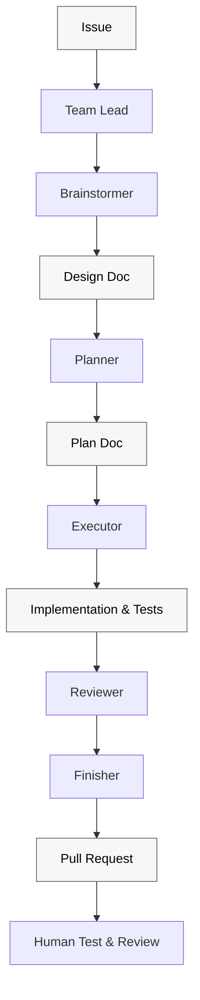
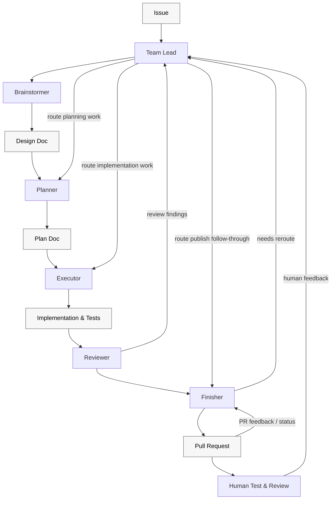

# Workflow diagrams

The workflow diagrams should stay structurally accurate and easy to read:

- use two Mermaid charts instead of trying to show chronology and orchestration in one diagram
- use only two block types: teammates and artifacts
- keep artifact nodes visually lighter with black text for readability
- keep the chronological chart simple and forward-moving
- keep the orchestration chart top-to-bottom and make `Team Lead` the routing hub for human feedback

## Chronological flow

## Orchestration flow

